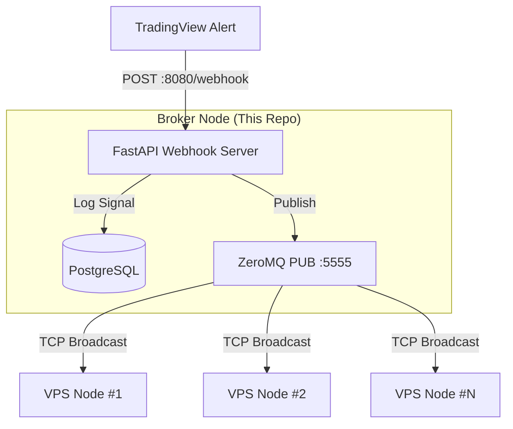

# 🚀 Algo Trading Broker

A high-performance, decentralized **trading signal broker** built with FastAPI and ZeroMQ. It acts as a central hub between TradingView alerts and distributed execution nodes (VPS).

## ⚡ Features

- **Webhook Hub**: Receives and validates TradingView JSON alerts.
- **Persistence**: Logs every signal to **PostgreSQL** for auditing and analytics.
- **Distribution**: Fans out signals via **ZeroMQ PUB** to multiple subscriber nodes.
- **Developer Friendly**: Includes Makefile, Bruno API collections, and Ruff for linting.

---

## 🏗️ System Architecture



---

## 📂 Project Structure

```text
algo-trading-broker/
├── broker/
│   ├── main.py              # Application entry point
│   ├── webhook.py           # FastAPI routes & logic
│   ├── publisher.py         # ZeroMQ PUB implementation
│   ├── settings.py          # Configuration (Pydantic Settings)
│   ├── logger.py            # Structured logging setup
│   ├── db/
│   │   ├── engine.py        # SQLAlchemy connection pool
│   │   ├── models.py        # SQLAlchemy ORM models
│   │   └── repository.py    # Database CRUD operations
│   └── schemas/
│       └── webhook.py       # Pydantic validation models
├── bruno/                   # Bruno API client collections
├── examples/                # Example scripts and payloads
├── Makefile                 # Automation shortcuts (uv, Linters)
├── Dockerfile               # Production container definition
├── docker-compose.yml       # Infrastructure (PostgreSQL)
└── pyproject.toml           # uv dependencies & tool config
```

---

## 🚀 Quick Start

### 1. Prerequisites
- Python 3.13+
- [uv](https://docs.astral.sh/uv/)
- Docker & Docker Compose

### 2. Installation
```bash
# Clone the repository
git clone <repository-url>
cd algo-trading-broker

# Setup environment variables
cp .env.example .env  # Update values in .env

# Install dependencies
make install-dev
```

### 3. Start Infrastructure
```bash
# Start PostgreSQL via Docker
docker compose up -d
```

### 4. Run the Broker
```bash
# Run locally
make run

# Or via Docker
docker compose up --build -d
```

---

## 🛠️ Development

We use `make` to simplify common tasks:

| Command | Description |
|---------|-------------|
| `make install` | Install production dependencies |
| `make install-dev` | Install all dependencies including dev tools |
| `make run` | Run the broker locally |
| `make format` | Format code with Ruff |
| `make lint` | Run Ruff check |
| `make fix` | Automatically fix linting issues |

---

## 📡 Webhook API

### POST `/webhook`

Receives signals from TradingView. Requires a valid `token` in the payload (if configured).

**Example Payload:**
```json
{
  "token": "your_secure_token",
  "symbol": "XAUUSD",
  "timeframe": "M5",
  "timestamp": "2024-03-20T10:00:00Z",
  "position": {
    "action": "LONG",
    "price": 1900.50,
    "quantity": 0.1,
    "sl": 1890.00,
    "tp1": 1920.00,
    "tp2": 1950.00,
    "is_running": true
  },
  "indicators": {
    "wt1": 12.5,
    "wt2": 10.2,
    "ema200": 1880.0
  },
  "inputs": {
    "risk_percent": 1.0,
    "use_session": true
  }
}
```

**Supported Actions:** `LONG`, `SHORT`, `TP1`, `TP2`, `R_SL`, `SL`.

---

## 🗄️ PostgreSQL Schema (`signal_log`)

| Column | Type | Description |
|--------|------|-------------|
| `id` | UUID (PK) | Unique record identifier |
| `symbol` | String(50) | Trading symbol (e.g., XAUUSD) |
| `timeframe` | String(20) | Chart timeframe (e.g., M15) |
| `timestamp` | DateTime | Signal generation time from TV |
| `action` | Enum | LONG, SHORT, TP1, TP2, R_SL, SL |
| `price` | Float | Entry/Trigger price |
| `quantity` | Float | Lot size / Volume |
| `sl`, `tp1`, `tp2` | Float | Exit prices |
| `is_running`| Boolean | Strategy state |
| `indicators` | JSONB | Full technical indicator state |
| `inputs` | JSONB | Strategy inputs / settings |
| `createdAt` | DateTime | Broker log insertion time |

---

## 🧪 Testing

Open the `/bruno` directory with the [Bruno API Client](https://www.usebruno.com/) to find pre-configured requests for testing the webhook and health endpoints.