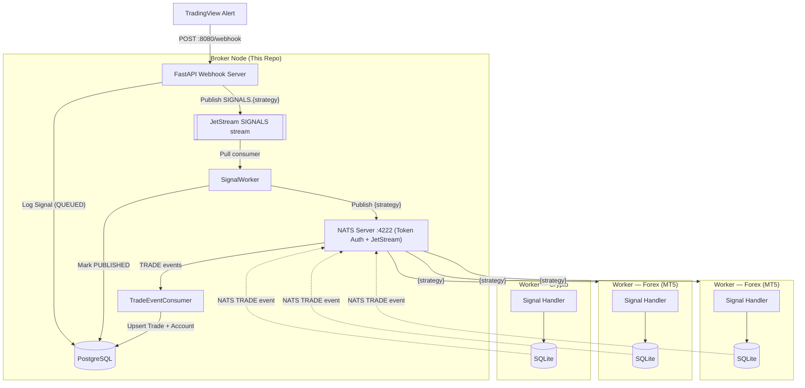

# Algo Trading Broker

A high-performance, decentralized **trading signal broker** built with FastAPI and NATS. It acts as a central hub between TradingView alerts and distributed execution nodes (VPS workers).

## ⚡ Quick Start

### 1. Prerequisites

- Python 3.13+
- [uv](https://docs.astral.sh/uv/)
- Docker & Docker Compose

### 2. Installation

```bash
git clone <repository-url>
cd algo-trading-broker

cp .env.example .env   # fill in values
make install-dev
```

### 3. Start Infrastructure

```bash
# Start PostgreSQL + NATS via Docker
docker compose up -d postgres nats
```

### 4. Run Database Migrations

```bash
make db-upgrade
```

### 5. Run the Broker

```bash
# Run locally (requires postgres and nats to be reachable)
make run

# Or run the full stack via Docker with hot-reload
make dev
```

---

## ✨ Features

- **Webhook Hub**: Receives and validates TradingView JSON alerts (with optional HMAC signature verification). Every alert is persisted (`status=QUEUED`) and pushed onto a **NATS JetStream** stream so the HTTP request returns as soon as the message is durably queued — the fan-out to workers runs in a background consumer, which closes the `Webhook delivery failed — server closed the connection unexpectedly` failure mode from holding the request open across the pipeline.
- **Persistence**: Logs every signal (with a `QUEUED` → `PUBLISHED` status), trade, and account snapshot to **PostgreSQL** via Alembic-managed migrations.
- **Distribution**: Fan-out signals via **NATS** — each strategy publishes to its own dedicated subject so workers subscribe only to what they need. A durable JetStream consumer (`broker_signal_handler`) does the fan-out so a broker restart mid-fan-out replays the message instead of losing it.
- **Signal replay on reconnect**: On every `WORKER_CONNECTED` handshake, the broker sends a `SYSTEM.RETRY_SIGNAL` back to the worker with every signal persisted in the last `max_retry_timeout` seconds whose strategy the worker announced — so a worker that just came back online catches up without needing external help.
- **Trade Feedback**: Workers report executed positions back to the broker via the NATS `TRADE` subject (no REST endpoint required).
- **Account Tracking**: Worker accounts are auto-upserted from every incoming trade event.
- **API Key Auth**: Management endpoints (`/accounts`, `/settings/*`) are protected by an `X-API-KEY` header validated against `BROKER_API_KEY`.
- **Signal Gating**: A `SIGNAL_BLOCKED` broker setting can pause signal forwarding without restarting the server.
- **Notifications**: Optional Telegram alerts for broker lifecycle events and published signals, plus optional forwarding of `ERROR`-level logs to a dedicated Telegram chat.
- **Developer Friendly**: Includes Makefile, Bruno API collections, Alembic CLI helpers, a pytest suite, and Ruff for linting.

---

## 🏗️ System Architecture



---

## 📁 Project Structure

```text
algo-trading-broker/
├── broker/
│   ├── api/             # FastAPI routers: api.py (v1), admin.py, webhook.py
│   ├── db/              # SQLAlchemy models, async engine, repository
│   ├── domain/          # Domain policies (e.g. trade-status state machine)
│   ├── helpers/         # Signal, timeframe, and message-formatting utilities
│   ├── interfaces/      # Protocols for DI (DB, notifier, publisher)
│   ├── schemas/         # Pydantic schemas (webhook, publisher, subscriber, trade, account, admin)
│   ├── security/        # Auth guard (ensure_api_key — X-API-KEY)
│   ├── services/        # nats_publisher, nats_service, notification, signal_processing
│   ├── app.py           # FastAPI application factory
│   ├── main.py          # Entrypoint (uvicorn runner)
│   ├── router.py        # Aggregates sub-routers under /v1, /admin, /secret
│   ├── providers.py     # Dependency-injection providers
│   ├── nats.py          # NATS connection lifecycle (connect/drain/close)
│   ├── openapi.py       # Shared OpenAPI response definitions
│   ├── constants.py     # Broker setting keys
│   ├── logger.py        # Logging configuration
│   └── settings.py      # Pydantic settings loaded from .env
├── alembic/             # Alembic migration environment and version scripts
├── bruno/               # Bruno API client collections
├── examples/            # Example webhook / NATS / worker JSON payloads
├── scripts/             # Utility scripts (docker-entrypoint, ensure_keys)
├── tests/               # Pytest unit tests
├── Makefile             # Automation shortcuts (uv, Docker, Alembic, linters)
├── Dockerfile           # Production container definition
├── docker-compose.yml   # Infrastructure (PostgreSQL + NATS + Broker)
└── pyproject.toml       # uv dependencies & tool config
```

---

## 📡 NATS Subjects

The broker uses **token-based authentication** with the NATS server. Workers must supply the same token when connecting.

| Direction | Subject | Purpose |
| --------- | ------- | ------- |
| Publish (broker → workers) | `{strategy}` | Signal routed to subscribers of that strategy (e.g. `wt_cross_v1`) |
| Publish (broker → workers) | `ADMIN` | Administrative / broadcast messages |
| Publish (broker → workers) | `SYSTEM` | System messages such as `CRYPTO_LEVERAGE_INIT` and `RETRY_SIGNAL` sent back after a worker announces itself |
| Publish (broker → broker) | `SIGNALS.<strategy>` (JetStream stream `SIGNALS`) | Durable webhook envelope buffer — the webhook endpoint enqueues here, the broker's own `SignalWorker` consumes and fans out to `{strategy}` |
| Subscribe (workers → broker) | `TRADE` | Position events reported by workers after execution |
| Subscribe (workers → broker) | `SYSTEM` | `WORKER_CONNECTED` announcements published by a worker right after it connects (payload carries `account_id` in `<market>-<gateway>-<account_id>` format, plus `market`, `gateway`, and `strategies`) |

Each signal is published to the subject that matches its `strategy` field. Workers subscribe only to the strategies they handle, eliminating cross-strategy noise.

### `TRADE` events

Workers publish a `TRADE` message (a `PositionEvent`) whenever a row in their local `positions` table is inserted or updated. The broker upserts it into the `trades` table keyed by `(account_id, ref_id)`, translating the worker's position status into a broker trade `status`:

| Worker position status | Broker trade `status` | Running? |
| ---------------------- | --------------------- | -------- |
| `OPENED` | `OPENED` | Yes |
| `TP1` | `PARTIALLY_CLOSED` | Yes |
| `TP2`, `SL`, `R_SL`, `TERMINAL_CLOSED`, `FORCED_CLOSED` | `CLOSED` | No |
| `FLATTED` | `FLAT` | No |
| `REJECTED` | `REJECTED` | No |

**`REJECTED`** is emitted when a worker refuses to place an order — for example when its **MAX ORDER** limit is reached. The worker still records the order in its own database and fires the `TRADE` event, so the broker persists a terminal, non-running trade carrying the worker's `reject_reason` (e.g. `"MAX ORDER limit reached"`). `REJECTED` ranks below every other status, so an event for an already-existing `ref_id` is treated as a lifecycle downgrade and ignored — only a brand-new order is recorded as rejected.

### JetStream signal pipeline

The webhook endpoint no longer runs the fan-out inline. Instead:

1. **Webhook** (`POST /secret/webhook`) verifies the `token`, checks the `signal_blocked` gate, persists the signal row with `status=QUEUED`, and pushes the raw envelope onto the JetStream stream `SIGNALS` (subject `SIGNALS.<strategy>`). TradingView gets `202 Accepted` (`status=queued`) as soon as JetStream acknowledges the write.
2. **`SignalWorker`** (`broker/services/signal_worker.py`) is a durable pull consumer (`broker_signal_handler`) that fetches envelopes from the stream, parses the payload, publishes to workers on `{strategy}` (or `ADMIN` for `FLAT`), sends the Telegram notification, and flips the DB row to `status=PUBLISHED` before acknowledging the JetStream message.

If the worker task crashes mid-processing, JetStream redelivers the message and the pipeline re-runs; the DB row's `status` therefore also acts as an audit signal — a row stuck at `QUEUED` means the message was persisted but the fan-out never completed. Enable JetStream on your NATS server (`nats-server -js -sd <path>`) — the bundled `docker-compose.yml` already does so and mounts the `nats_data` volume for durability.

### `SYSTEM` handshake

When a worker successfully connects to NATS, it announces itself on the `SYSTEM` subject. `account_id`, `market`, and `gateway` are all required — messages missing any of them are rejected by validation. `strategies` is optional; when set, it lists the strategy subjects the worker subscribes to and drives the `RETRY_SIGNAL` replay described below.

```json
{
  "action": "WORKER_CONNECTED",
  "account_id": "CRYPTO-BINANCE-7654321",
  "timestamp": "2026-06-30T00:00:00+00:00",
  "market": "CRYPTO",
  "gateway": "BINANCE",
  "strategies": ["wt_cross_v1", "MT5_GOLD_M5_V1"]
}
```

#### Request/reply (recommended)

Workers should announce themselves with **NATS request/reply** (`nc.request(...)`) rather than a fire-and-forget publish. The broker replies **directly on the request's inbox** with the outcome of the handshake, so:

- the reply reaches only the worker that asked (no fan-out to every `SYSTEM` subscriber), and
- the worker's `request` **always resolves** — on success, on a no-op, or on an error — instead of hanging.

Because the reply is worker-driven, a worker that connects while the broker is **down or restarting** simply **times out and retries**; the handshake is idempotent, so retries are safe. This closes the delivery gap of plain fire-and-forget pub/sub, where a `WORKER_CONNECTED` published before the broker's subscription was active would be lost silently.

The broker answers with one of three actions:

| Situation | Reply action | Payload |
| --------- | ------------ | ------- |
| Crypto worker, settings loaded | `CRYPTO_LEVERAGE_INIT` | `symbols`, `default_leverage` |
| Non-crypto worker | `WORKER_CONNECTED_ACK` | — (nothing to configure) |
| Crypto settings missing/invalid | `WORKER_CONNECTED_ERROR` | `reason` |

In addition, every valid `WORKER_CONNECTED` also gets a `RETRY_SIGNAL` (see [Signal replay on reconnect](#signal-replay-on-reconnect) below) so a worker that just reconnected can catch up on broadcasts it missed while offline.

For a crypto worker, the broker loads the `crypto_allowed_symbol` and `crypto_max_leverage` `BrokerSetting` rows and replies with `CRYPTO_LEVERAGE_INIT`:

```json
{
  "action": "CRYPTO_LEVERAGE_INIT",
  "account_id": "CRYPTO-BINANCE-7654321",
  "timestamp": "2026-06-30T00:00:00+00:00",
  "symbols": ["BTC", "ETH"],
  "default_leverage": 10
}
```

If the crypto settings are missing or invalid, the worker gets an explicit error it can log or retry on, instead of silently receiving nothing:

```json
{
  "action": "WORKER_CONNECTED_ERROR",
  "account_id": "CRYPTO-BINANCE-7654321",
  "timestamp": "2026-06-30T00:00:00+00:00",
  "reason": "crypto settings not configured"
}
```

#### Fire-and-forget (backward compatible)

A worker may still `publish` `WORKER_CONNECTED` without a reply inbox. In that case the broker broadcasts `CRYPTO_LEVERAGE_INIT` on the shared `SYSTEM` subject for crypto workers (workers filter by `account_id`); non-crypto and error outcomes can only be logged, not signalled back. Request/reply is preferred precisely because it removes those blind spots.

The broker filters its own outgoing `SYSTEM` actions (`CRYPTO_LEVERAGE_INIT`, `WORKER_CONNECTED_ACK`, `WORKER_CONNECTED_ERROR`) by `action`, so it never reacts to its own messages.

#### Signal replay on reconnect

Every valid `WORKER_CONNECTED` triggers a `RETRY_SIGNAL` reply carrying every signal the broker persisted in the last `max_retry_timeout` seconds (default `60`, tunable via the `max_retry_timeout` broker setting) whose `strategy` is in the worker's announced `strategies` list. The payload is a **list** of the same signal objects normally published on the `{strategy}` subject, so the worker can feed them straight back into its usual signal handler.

Sent on the request's reply inbox when the worker used NATS request/reply, otherwise broadcast on the shared `SYSTEM` subject. Nothing is sent when the worker did not announce any strategies. Example: `examples/nats/system.retry_signal.json`.

```json
{
  "action": "RETRY_SIGNAL",
  "account_id": "CRYPTO-BINANCE-7654321",
  "timestamp": "2026-07-16T00:00:00+00:00",
  "signals": [
    {
      "signal_id": "sig_123456789_long",
      "timestamp": "2026-07-15T23:59:30+00:00",
      "strategy": "wt_cross_v1",
      "action": "LONG",
      "symbol": "XAUUSD",
      "price": 2350.5,
      "quantity": 0.1,
      "sl": 2340.0,
      "tp1": 2370.0,
      "tp2": 2390.0,
      "risk_percent": 1.0
    }
  ]
}
```

#### Live config push on admin update

The handshake pushes crypto config when a worker *connects*. To also update workers that are **already connected**, `POST /admin/settings/crypto-allowed-symbol` and `POST /admin/settings/crypto-max-leverage` send a `CRYPTO_LEVERAGE_INIT` on the shared `SYSTEM` subject right after persisting the change, so the new value applies immediately instead of waiting for the next reconnect (up to the ~30s settings cache).

The broker looks up every **crypto account** in the `accounts` table and addresses one message per account to its `<market>-<gateway>-<account_id>` worker id — built from the account's `market_type`, `gateway`, and `account_id` — so each worker filters by its own id:

```json
{
  "action": "CRYPTO_LEVERAGE_INIT",
  "account_id": "CRYPTO-BINANCE-7654321",
  "timestamp": "2026-06-30T00:00:00+00:00",
  "symbols": ["BTC", "ETH"],
  "default_leverage": 10
}
```

Both `symbols` and `default_leverage` are read back from `BrokerSetting`, so whichever setting the admin did *not* just change is included from the DB. The push is best-effort: the setting is already persisted (and still reaches workers on their next handshake), so if the complementary setting is missing or invalid, a crypto account has no `gateway` recorded yet, or a publish fails — the affected message is logged and skipped while the endpoint still returns `200`.

---

## ⚙️ Configuration (`.env`)

```env
# ── Server ───────────────────────────────────────────
BROKER_PUBLIC_URL=server_ip_or_domain

# ── Webhook ──────────────────────────────────────────
WEBHOOK_HOST=0.0.0.0
WEBHOOK_PORT=80

# Optional HMAC secret — set the same value in TradingView alert header
# X-Signature: <sha256-hex-of-body>
# Leave blank to disable validation.
WEBHOOK_SECRET=

# Callback API key for authenticating requests to the broker API
BROKER_API_KEY=api_key

# Secret URL prefix — all routes are mounted under /<BROKER_API_PREFIX>/
# e.g. set to "abc123xyz" → endpoints become /abc123xyz/v1/..., /abc123xyz/admin/..., etc.
# Leave blank to use the default paths without a prefix.
BROKER_API_PREFIX=

# ── NATS ─────────────────────────────────────────────
NATS_HOST=localhost        # overridden to "nats" inside Docker
NATS_PORT=4222
NATS_MONITOR_PORT=8222
NATS_TOKEN=changeme       # shared secret; leave blank = no auth

# ── PostgreSQL ────────────────────────────────────────
POSTGRES_HOST=localhost
POSTGRES_PORT=5432
POSTGRES_DB=algo_trading_broker
POSTGRES_USER=algo_trading
POSTGRES_PASSWORD=algotrading_broker_db_password

# ── Logging ──────────────────────────────────────────
LOG_LEVEL=INFO

# ── API Docs ─────────────────────────────────────────
# Set to false in production to hide /docs, /redoc and /openapi.json.
DOCS_ENABLED=false

# ── Telegram (optional) ──────────────────────────────
TELEGRAM_ENABLED=false
TELEGRAM_BOT_TOKEN=
TELEGRAM_CHAT_ID=           # management chat: broker lifecycle events
TELEGRAM_CHAT_CHANNEL_ID=   # signals channel: published trade alerts

# Forward log records at ERROR level or above to Telegram.
TELEGRAM_LOG_ERRORS_ENABLED=false
TELEGRAM_LOG_DEDUP_WINDOW=60   # seconds — suppress identical messages
TELEGRAM_LOG_BOT_TOKEN=        # dedicated log bot (falls back to TELEGRAM_BOT_TOKEN)
TELEGRAM_LOG_CHAT_ID=          # dedicated log chat (falls back to TELEGRAM_CHAT_ID)
```

---

## 🛠️ Development

| Command | Description |
| ----------------------- | ----------------------------------------------- |
| `make install` | Install production dependencies |
| `make install-dev` | Install all dependencies including dev tools |
| `make update` | Upgrade dependencies and regenerate `uv.lock` |
| `make lock` | Regenerate `uv.lock` |
| `make run` | Run the broker locally |
| `make build` | Rebuild the Docker image (`--no-cache`) |
| `make dev` | Start Docker stack with hot-reload (`compose watch`) |
| `make start` | Start Docker stack detached |
| `make stop` | Stop Docker stack |
| `make logs` | Tail broker container logs (last 500 lines) |
| `make logging` | Follow broker container logs live |
| `make format` | Format code with Ruff |
| `make lint` | Run Ruff check |
| `make check` | Alias for `make lint` |
| `make fix` | Format and auto-fix linting issues |

### Database (Alembic)

| Command | Description |
| ----------------------------- | ------------------------------------------- |
| `make db-upgrade` | Apply all pending migrations (`upgrade head`) |
| `make db-downgrade` | Roll back one migration step |
| `make db-history` | Show full migration history |
| `make db-current` | Show current revision in the database |
| `make db-revision m='msg'` | Generate a new auto-migration file |

---

## 🌐 API

### Interactive docs (Swagger / OpenAPI)

FastAPI auto-generates interactive API documentation. With the server running:

| Page | URL | Notes |
| ---- | --- | ----- |
| Swagger UI | `http://localhost:8080/docs` | Try endpoints; click **Authorize** to set `X-API-KEY`. |
| ReDoc | `http://localhost:8080/redoc` | Read-only reference. |
| OpenAPI schema | `http://localhost:8080/openapi.json` | Raw spec. |

Set `DOCS_ENABLED=false` in `.env` to disable all three in production.

### URL Prefixes

All routes are grouped under versioned or purpose-scoped prefixes:

| Prefix | Router | Description |
| ------ | ------ | ----------- |
| `/v1` | API | Public API endpoints (accounts, trades, health) |
| `/admin` | Admin | Management endpoints (settings, trading actions) |
| `/secret` | Webhook | TradingView webhook receiver |

If `BROKER_API_PREFIX` is set (e.g. `abc123xyz`), every route is mounted under that secret segment:

```text
/abc123xyz/v1/health
/abc123xyz/v1/accounts
/abc123xyz/admin/flat
/abc123xyz/secret/webhook
```

The prefix acts as a URL secret — an attacker who knows the IP or domain still cannot enumerate endpoints without it. Leave blank to use the default paths.

### Authentication

Management endpoints require an API key passed in the `X-API-KEY` header, validated against `BROKER_API_KEY`:

```bash
curl http://localhost:8080/v1/accounts -H "X-API-KEY: $BROKER_API_KEY"
```

Missing or invalid keys return `401 Unauthorized`. If `BROKER_API_KEY` is unset, protected endpoints return `500`. The `/v1/health` and `/secret/webhook` endpoints are **not** key-protected (`/secret/webhook` uses its own in-payload `token`).

| Endpoint | Auth |
| -------- | ---- |
| `GET /v1/health` | None |
| `POST /secret/webhook` | In-payload `token` (+ optional HMAC) |
| `GET /v1/accounts` | `X-API-KEY` |
| `GET /v1/{account_id}/trades` | `X-API-KEY` |
| `POST /admin/settings/block-signal` | `X-API-KEY` |
| `POST /admin/settings/silent-signal` | `X-API-KEY` |
| `POST /admin/settings/include-signal-raw` | `X-API-KEY` |
| `POST /admin/settings/crypto-allowed-symbol` | `X-API-KEY` |
| `POST /admin/settings/crypto-max-leverage` | `X-API-KEY` |
| `POST /admin/settings/notification-timezone` | `X-API-KEY` |
| `POST /admin/flat` | `X-API-KEY` |

---

### GET `/v1/health`

Returns `{"status": "ok"}`. No authentication required.

---

### POST `/secret/webhook`

Receives signals from TradingView. Validates the optional HMAC `X-Signature` header if `WEBHOOK_SECRET` is set. Persists the signal (`status=QUEUED`) and pushes the raw envelope onto the JetStream `SIGNALS` stream (`SIGNALS.<strategy>`) — the background `SignalWorker` picks it up and publishes to the NATS subject matching `signal.strategy` (e.g. `wt_cross_v1`) before flipping the row to `PUBLISHED`. Responds `202 Accepted` (`status=queued`) as soon as the message is durably queued, so TradingView is not held open across the fan-out.

**Example Payload:**

```json
{
  "token": "your_secure_token",
  "strategy": "wt_cross_v1",
  "symbol": "XAUUSD",
  "timeframe": "M5",
  "timestamp": "2024-03-20T10:00:00Z",
  "position": {
    "action": "LONG",
    "price": 1900.5,
    "quantity": 0.1,
    "sl": 1890.0,
    "tp1": 1920.0,
    "tp2": 1950.0,
    "is_running": true,
    "is_scale_position": true,
    "scaling": {
      "tp": 1925.0,
      "sl": 1895.0,
      "quantity": 0.05
    }
  },
  "indicators": {
    "wt1": 12.5,
    "wt2": 10.2,
    "ema200": 1880.0
  },
  "inputs": {
    "risk_percent": 1.0,
    "use_session": true
  }
}
```

**Supported Actions:** `LONG`, `SHORT`, `TP1`, `TP2`, `R_SL`, `SL`, `FLAT`.

#### Position fields — `tp1`/`tp2`/`sl` vs `scaling`

A TradingView strategy can contain **multiple sub-strategies** running under the same parent strategy name. Each sub-strategy may apply different risk/reward profiles to the same signal — for example, a `LOW_RR_TIER` sub-strategy is designed to catch entries more frequently but accepts a tighter TP and higher relative risk, which means the effective TP, SL, and quantity differ from the base signal values.

To support this, the `position` block carries two sets of exit levels:

| Field | Purpose |
| ----- | ------- |
| `tp1`, `tp2`, `sl` | Base levels from the **primary** strategy logic — always present. |
| `is_scale_position` | `true` when a sub-strategy wants to **scale into** an existing open position rather than open a new one. |
| `scale_strategy` | Name of the sub-strategy that triggered the scale-in (e.g. `LOW_RR_TIER`). Lets workers apply sub-strategy-specific position sizing or risk rules. |
| `scaling.tp`, `scaling.sl`, `scaling.quantity` | **Override** levels and size for the scale-in leg. These replace `tp1`/`sl`/`quantity` for the additional entry — they are forwarded on the NATS `SIGNAL` payload only when `is_scale_position` is `true`. |

**Example flow:** the main strategy fires a `LONG` signal with `tp1=1950, sl=1890`. At the same bar, the embedded `LOW_RR_TIER` sub-strategy decides to add to the position with a tighter target (`tp=1925`) and smaller size (`quantity=0.05`). The webhook sets `is_scale_position=true`, `scale_strategy="LOW_RR_TIER"`, and populates the `scaling` block accordingly. Workers that receive the signal can read `scale_strategy` to decide whether to apply the scale-in and by how much.

---

### GET `/v1/accounts`

Returns all trading accounts ordered by most recent activity. Requires the `X-API-KEY` header.

**Response:**

```json
[
  {
    "id": "uuid",
    "account_id": "12345678",
    "account_name": "Demo Account",
    "account_balance": 10000.0,
    "market_type": "FOREX",
    "gateway": "MT5",
    "last_activity_at": "2024-03-20T10:05:00Z",
    "createdAt": "2024-03-01T00:00:00Z",
    "updatedAt": "2024-03-20T10:05:00Z"
  }
]
```

Accounts are automatically created or updated each time a `TRADE` event arrives from a worker. `gateway` records the exchange the account trades through (e.g. `MT5` for forex, `BINANCE` for crypto), taken from the `TRADE` event; combined with `market_type` and `account_id` it forms the `<market>-<gateway>-<account_id>` worker id the broker uses to address `SYSTEM` messages.

---

### GET `/v1/{account_id}/trades`

Returns a paginated list of trades for the given account. Requires the `X-API-KEY` header.

**Query Parameters:**

| Parameter | Default | Description |
| --------- | ------- | ----------- |
| `limit` | `20` | Number of results (1–100) |
| `offset` | `0` | Skip this many rows |
| `order` | `desc` | Sort direction: `asc` or `desc` |
| `order_by` | `updatedAt` | Sort column: `updatedAt`, `createdAt`, `status`, `symbol` |

**Response:**

```json
{
  "data": [
    {
      "id": "3fa85f64-5717-4562-b3fc-2c963f66afa6",
      "account_id": "MT5-12345678",
      "account_leverage": 100,
      "account_balance_init": 10000.0,
      "account_balance": 10250.75,
      "ref_id": "987654321",
      "comment": null,
      "strategy_code": "LONG|SIG-001",
      "gateway_return_code": 0,
      "strategy": "BTC-M15",
      "symbol": "BTCUSDT",
      "action": "LONG",
      "price": 65000.0,
      "quantity": 0.01,
      "sl": 63000.0,
      "tp1": 67000.0,
      "tp2": 69000.0,
      "is_running": true,
      "risk_percent": 1.0,
      "status": "OPENED",
      "reject_reason": null,
      "createdAt": "2026-06-01T08:00:00Z",
      "updatedAt": "2026-06-02T09:30:00Z"
    }
  ],
  "page": {
    "total": 42,
    "limit": 20,
    "offset": 0,
    "order": "desc",
    "order_by": "updatedAt"
  }
}
```

---

### POST `/admin/settings/block-signal`

Toggles the `SIGNAL_BLOCKED` broker setting between `"1"` (signals blocked) and `"0"` (signals forwarded). Requires the `X-API-KEY` header. Does not require a restart. Sends a Telegram notification on change.

---

### POST `/admin/settings/silent-signal`

Toggles the `SILENT_SIGNAL` broker setting between `"1"` (Telegram notifications muted) and `"0"` (notifications active). Useful for pausing alerts without disabling Telegram entirely. Requires the `X-API-KEY` header.

---

### POST `/admin/settings/include-signal-raw`

Toggles the `NOTIFICATION_INCLUDE_SIGNAL_RAW` setting. When enabled (`"1"`), Telegram signal notifications include the full `indicators` and `inputs` blocks. Requires the `X-API-KEY` header.

---

### POST `/admin/settings/crypto-allowed-symbol`

Sets the `crypto_allowed_symbol` broker setting pushed to crypto workers via `SYSTEM.CRYPTO_LEVERAGE_INIT`. Requires the `X-API-KEY` header.

**Request Body:**

```json
{
  "symbols": ["BTC", "ETH"]
}
```

Symbols are upper-cased, trimmed, and de-duplicated before being stored as a comma-separated string. At least one non-empty symbol is required (`422` otherwise).

On success the broker also **pushes** a targeted `SYSTEM.CRYPTO_LEVERAGE_INIT` to each crypto account by its `<market>-<gateway>-<account_id>` worker id (see [Live config push on admin update](#live-config-push-on-admin-update)), so already-running workers apply the new list immediately. That message also carries `crypto_max_leverage` read from the DB, so it is skipped (and logged) until that setting is configured. A worker that *connects* right after this call may still read the previous value from `SystemEventConsumer`'s up-to-30s cache.

---

### POST `/admin/settings/crypto-max-leverage`

Sets the `crypto_max_leverage` broker setting pushed to crypto workers via `SYSTEM.CRYPTO_LEVERAGE_INIT`. Requires the `X-API-KEY` header.

**Request Body:**

```json
{
  "default_leverage": 10
}
```

`default_leverage` must be a positive integer (`422` otherwise).

On success the broker also **pushes** a targeted `SYSTEM.CRYPTO_LEVERAGE_INIT` to each crypto account by its `<market>-<gateway>-<account_id>` worker id (see [Live config push on admin update](#live-config-push-on-admin-update)), so already-running workers apply the new leverage immediately. That message also carries `crypto_allowed_symbol` read from the DB, so it is skipped (and logged) until that setting is configured. A worker that *connects* right after this call is still subject to the same up-to-30s cache as `crypto-allowed-symbol`.

---

### POST `/admin/settings/notification-timezone`

Sets the `notification_timezone` broker setting: the UTC offset (in hours) applied to the `Time:` line of Telegram notifications. Requires the `X-API-KEY` header.

**Request Body:**

```json
{
  "utc_offset_hours": 7
}
```

`utc_offset_hours` must be between `-12` and `14` (`422` otherwise). Signal timestamps are normalised to UTC first, then shifted by this offset before formatting, e.g. `Time: 2026-07-06 12:55:00 (UTC+7)`. Defaults to `7` (UTC+7) when unset.

---

### POST `/admin/flat`

Publishes a `FLAT` directive to all connected workers via the `ADMIN` NATS subject. Scope can be narrowed by passing optional fields in the JSON body.

**Request Body (all fields optional):**

```json
{
  "strategy": "wt_cross_v1",
  "symbol": "XAUUSD",
  "account_id": "MT5-12345678"
}
```

Omit all fields (or send an empty body `{}`) to flat every open position across all workers.

---

## 🗄️ PostgreSQL Schema

### `signals` table

| Column | Type | Description |
| ------------------ | ---------------- | --------------------------------------- |
| `id` | UUID (PK) | Unique record identifier |
| `strategy` | String(50) | Strategy name that generated the signal |
| `symbol` | String(50) | Trading symbol (e.g., XAUUSD) |
| `timeframe` | String(20) | Chart timeframe (e.g., M15) |
| `timestamp` | DateTime | Signal generation time from TradingView |
| `action` | Enum | LONG, SHORT, TP1, TP2, R_SL, SL, FLAT |
| `price` | Numeric(20,8) | Entry/trigger price |
| `quantity` | Numeric(20,8) | Lot size / volume |
| `sl`, `tp1`, `tp2` | Numeric(20,8) | Exit prices (nullable) |
| `is_running` | Boolean | Strategy active state |
| `risk_percent` | Numeric(10,4) | Risk percentage for position sizing |
| `is_scale_position` | Boolean | Whether this signal scales into an existing position |
| `scale_strategy` | String(50) (Nullable) | Scale-in strategy name (e.g. `add_on_pullback`) |
| `status` | Enum | Delivery state: `QUEUED` on insert, `PUBLISHED` once the JetStream `SignalWorker` has fanned it out |
| `indicators` | JSONB (Nullable) | Full technical indicator snapshot |
| `inputs` | JSONB (Nullable) | Strategy input parameters |
| `raw` | JSONB (Nullable) | Raw webhook payload |
| `createdAt` | DateTime | Broker log insertion time |

### `trades` table

| Column | Type | Description |
| ----------------------- | ------------ | ------------------------------------------ |
| `id` | UUID (PK) | Unique record identifier |
| `account_id` | String(50) | Worker's broker account ID |
| `account_leverage` | Integer | Account leverage at time of trade |
| `account_balance_init` | Numeric(20,8) | Account balance before trade (nullable) |
| `account_balance` | Numeric(20,8) | Account balance after trade (nullable) |
| `strategy` | String(50) | Strategy that originated the signal |
| `strategy_code` | String(255) | Mapping between strategy and number (defined by Worker) |
| `ref_id` | String(255) | Worker's source position reference id (original entry; shared by all child executions; nullable) |
| `symbol` | String(50) | Trading symbol |
| `action` | Enum | LONG, SHORT, TP1, TP2, R_SL, SL, FLAT |
| `price` | Numeric(20,8) | Execution price |
| `quantity` | Numeric(20,8) | Lot size |
| `sl`, `tp1`, `tp2` | Numeric(20,8) | Exit prices (nullable) |
| `is_running` | Boolean | Strategy active state |
| `risk_percent` | Numeric(10,4) | Risk percentage used |
| `comment` | String(255) | Trade comment (nullable) |
| `gateway_return_code` | Integer | Return code from the exchange gateway (nullable) |
| `status` | Enum | OPENED, REJECTED, PARTIALLY_CLOSED, CLOSED, FLAT |
| `reject_reason` | String(255) | Reason if trade was rejected (nullable) |
| `createdAt` | DateTime | Record insertion time |
| `updatedAt` | DateTime | Last update time |

### `accounts` table

| Column | Type | Description |
| ------------------- | ------------ | ------------------------------------------ |
| `id` | UUID (PK) | Unique record identifier |
| `account_id` | String(50) | Worker's broker account ID (unique) |
| `account_name` | String(255) | Display name of the account (nullable) |
| `account_balance` | Numeric(20,8) | Most recent account balance (nullable) |
| `market_type` | Enum | `FOREX` or `CRYPTO` |
| `gateway` | String(50) | Exchange the account trades through, e.g. `MT5`, `BINANCE` (nullable) |
| `last_activity_at` | DateTime | Timestamp of the last TRADE event received |
| `createdAt` | DateTime | Record insertion time |
| `updatedAt` | DateTime | Last update time |

### `broker_settings` table

| Column | Type | Description |
| ------- | ------------ | --------------------------------------- |
| `id` | UUID (PK) | Unique record identifier |
| `key` | String(255) | Setting key (see known keys below) |
| `value` | Text | Setting value (`"0"` / `"1"` for flags) |

**Known setting keys:**

| Key | Default | Admin endpoint | Description |
| --- | ------- | --------------- | ----------- |
| `signal_blocked` | `"0"` | `POST /admin/settings/block-signal` | Pause signal forwarding to workers |
| `silent_signal` | `"0"` | `POST /admin/settings/silent-signal` | Mute Telegram signal notifications |
| `notification_include_signal_raw` | `"0"` | `POST /admin/settings/include-signal-raw` | Append indicators/inputs to notifications |
| `crypto_allowed_symbol` | `"BTC,ETH"` | `POST /admin/settings/crypto-allowed-symbol` | Comma-separated list of crypto symbols pushed to workers via `SYSTEM.CRYPTO_LEVERAGE_INIT` |
| `crypto_max_leverage` | `"10"` | `POST /admin/settings/crypto-max-leverage` | Default leverage pushed to workers via `SYSTEM.CRYPTO_LEVERAGE_INIT` |
| `notification_timezone` | `"7"` | `POST /admin/settings/notification-timezone` | UTC offset (hours) applied to the `Time:` line of Telegram notifications |
| `max_retry_timeout` | `"60"` | — (edit directly) | Seconds of history included in the `SYSTEM.RETRY_SIGNAL` replay sent to a freshly-connected worker |

---

## 🧪 Testing

### Unit tests (pytest)

```bash
uv run pytest
```

The suite (`tests/`) covers the signal helper, the signal-processing service, and the trade-status policy. `pytest-asyncio` runs in `auto` mode, so async tests need no extra decorators.

### Manual API testing (Bruno)

Open the `bruno/` directory with the [Bruno API Client](https://www.usebruno.com/) to find pre-configured requests for the webhook, accounts, trades, settings, and health endpoints.

The `examples/` directory also holds sample JSON payloads for webhook, NATS, and worker (`TRADE` event) messages.
