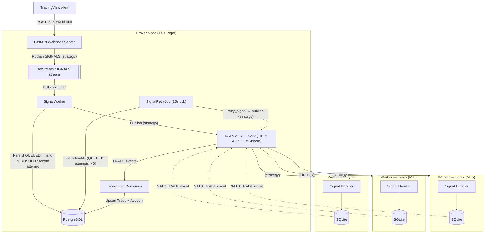

# Algo Trading Broker

A high-performance, decentralized **trading signal broker** built with FastAPI and NATS. It acts as a central hub between TradingView alerts and distributed execution nodes (VPS workers).

## ⚡ Quick Start

### 1. Prerequisites

- Python 3.13+
- [uv](https://docs.astral.sh/uv/)
- Docker & Docker Compose

### 2. Installation

```bash
git clone <repository-url>
cd algo-trading-broker

cp .env.example .env   # fill in values
make install-dev
```

### 3. Start Infrastructure

```bash
# Start PostgreSQL + NATS via Docker
docker compose up -d postgres nats
```

### 4. Run Database Migrations

```bash
make db-upgrade
```

### 5. Run the Broker

```bash
# Run locally (requires postgres and nats to be reachable)
make run

# Or run the full stack via Docker with hot-reload
make dev
```

### 6. (Optional) Run the Telegram Bot

```bash
docker compose up -d bot
```

The bot is a separate service under [`bot/`](bot/) with its own BotFather token
and uv project. It reads the same root `.env`. See
[`bot/README.md`](bot/README.md) for setup and local development.

---

## ✨ Features

- **Webhook Hub**: Receives and validates TradingView JSON alerts (with optional HMAC signature verification). Every alert is persisted (`status=QUEUED`) and pushed onto a **NATS JetStream** stream so the HTTP request returns as soon as the message is durably queued — the fan-out to workers runs in a background consumer, which closes the `Webhook delivery failed — server closed the connection unexpectedly` failure mode from holding the request open across the pipeline.
- **Persistence**: Logs every signal (with a `QUEUED` → `PUBLISHED` status), trade, and account snapshot to **PostgreSQL** via Alembic-managed migrations.
- **Distribution**: Fan-out signals via **NATS** — each strategy publishes to its own dedicated subject so workers subscribe only to what they need. A durable JetStream consumer (`broker_signal_handler`) does the fan-out so a broker restart mid-fan-out replays the message instead of losing it.
- **Signal replay on reconnect**: On every `WORKER_CONNECTED` handshake, the broker sends a `SYSTEM.RETRY_SIGNALS` back to the worker with every signal persisted in the last `max_retry_timeout` seconds whose strategy the worker announced — so a worker that just came back online catches up without needing external help.
- **Trade Feedback**: Workers report executed positions back to the broker via the NATS `TRADE` subject (no REST endpoint required).
- **Account Tracking**: Worker accounts are auto-upserted from every incoming trade event.
- **API Key Auth**: Management endpoints (`/accounts`, `/settings/*`) are protected by an `X-API-KEY` header validated against `BROKER_API_KEY`.
- **Signal Gating**: A `SIGNAL_BLOCKED` broker setting can pause signal forwarding without restarting the server.
- **Notifications**: Optional Telegram alerts for broker lifecycle events and published signals, plus optional forwarding of `ERROR`-level logs to a dedicated Telegram chat.
- **Developer Friendly**: Includes Makefile, Bruno API collections, Alembic CLI helpers, a pytest suite, and Ruff for linting.

---

## 🏗️ System Architecture



---

## 📁 Project Structure

```text
algo-trading-broker/
├── broker/
│   ├── api/             # FastAPI routers: api.py (v1), admin.py, telegram.py, webhook.py
│   ├── db/              # SQLAlchemy models, async engine, repository
│   ├── domain/          # Domain policies (e.g. trade-status state machine)
│   ├── helpers/         # Signal, timeframe, and message-formatting utilities
│   ├── interfaces/      # Protocols for DI (DB, notifier, publisher)
│   ├── schemas/         # Pydantic schemas (webhook, publisher, subscriber, trade, account, admin)
│   ├── security/        # Auth guard (ensure_api_key — X-API-KEY)
│   ├── services/        # nats_service, notification_service,
│   │                    #   signal_processing_service (+ SignalWorker), signal_retry_job
│   ├── app.py           # FastAPI application factory
│   ├── main.py          # Entrypoint (uvicorn runner)
│   ├── router.py        # Aggregates sub-routers under /v1, /admin, /secret
│   ├── providers.py     # Dependency-injection providers
│   ├── nats.py          # NATS connection lifecycle (connect/drain/close)
│   ├── openapi.py       # Shared OpenAPI response definitions
│   ├── constants.py     # Broker setting keys
│   ├── logger.py        # Logging configuration
│   └── settings.py      # Pydantic settings loaded from .env
├── bot/                 # Telegram bot service (aiogram v3) — see bot/README.md
│   ├── app/             # handlers, services, middlewares, keyboards, presenters, utils
│   └── tests/           # Bot pytest suite (own pyproject.toml / uv project)
├── alembic/             # Alembic migration environment and version scripts
├── bruno/               # Bruno API client collections
├── examples/            # Example webhook / NATS / worker JSON payloads
├── scripts/             # Utility scripts (docker-entrypoint, ensure_keys)
├── tests/               # Pytest unit tests
├── Makefile             # Automation shortcuts (uv, Docker, Alembic, linters)
├── Dockerfile           # Production container definition
├── docker-compose.yml   # Infrastructure (PostgreSQL + NATS + Broker)
└── pyproject.toml       # uv dependencies & tool config
```

---

## 📡 NATS Subjects

The broker uses **token-based authentication** with the NATS server. Workers must supply the same token when connecting.

| Direction | Subject | Purpose |
| --------- | ------- | ------- |
| Publish (broker → workers) | `{strategy}` | Signal routed to subscribers of that strategy (e.g. `wt_cross_v1`) |
| Publish (broker → workers) | `ADMIN` | Administrative / broadcast messages |
| Publish (broker → workers) | `SYSTEM` | System messages such as `CRYPTO_LEVERAGE_INIT` and `RETRY_SIGNALS` sent back after a worker announces itself |
| Publish (broker → broker) | `SIGNALS.<strategy>` (JetStream stream `SIGNALS`) | Durable webhook envelope buffer — the webhook endpoint enqueues here, the broker's own `SignalWorker` consumes and fans out to `{strategy}` |
| Subscribe (workers → broker) | `TRADE` | Position events reported by workers after execution |
| Subscribe (workers → broker) | `SYSTEM` | `WORKER_CONNECTED` announcements published by a worker right after it connects (payload carries `account_id` in `<market>-<gateway>-<account_id>` format, plus `market`, `gateway`, and `strategies`) |

Each signal is published to the subject that matches its `strategy` field. Workers subscribe only to the strategies they handle, eliminating cross-strategy noise.

Every payload on `{strategy}` — whether it's a full `TradingSignal` (LONG/SHORT/TP/…) or the shorter FLAT directive — carries a `signal_id`. That is the same id the broker uses inside a `SYSTEM.RETRY_SIGNALS` replay bundle, so a worker that sees a signal live and then again as part of a reconnect replay can de-duplicate by `signal_id`.

### `TRADE` events

Workers publish a `TRADE` message (a `PositionEvent`) whenever a row in their local `positions` table is inserted or updated. The broker upserts it into the `trades` table keyed by `(market, gateway, account_id, ref_id)` — not `account_id` alone, since the same bare `account_id` can exist under a different market/gateway (see [`accounts` table](#accounts-table)) — translating the worker's position status into a broker trade `status`:

| Worker position status | Broker trade `status` | Running? |
| ---------------------- | --------------------- | -------- |
| `OPENED` | `OPENED` | Yes |
| `TP1` | `PARTIALLY_CLOSED` | Yes |
| `TP2`, `SL`, `R_SL`, `TERMINAL_CLOSED`, `FORCED_CLOSED` | `CLOSED` | No |
| `FLATTED` | `FLAT` | No |
| `REJECTED` | `REJECTED` | No |

**`REJECTED`** is emitted when a worker refuses to place an order — for example when its **MAX ORDER** limit is reached. The worker still records the order in its own database and fires the `TRADE` event, so the broker persists a terminal, non-running trade carrying the worker's `reject_reason` (e.g. `"MAX ORDER limit reached"`). `REJECTED` ranks below every other status, so an event for an already-existing `ref_id` is treated as a lifecycle downgrade and ignored — only a brand-new order is recorded as rejected.

### JetStream signal pipeline

The webhook endpoint is a fast enqueue-only path. Everything else runs from a background handler, with a retry loop that can re-try failed signals a bounded number of times.

1. **Webhook** (`POST /secret/webhook`) verifies the `token` and pushes the raw envelope onto the JetStream stream `SIGNALS` (subject `SIGNALS.<strategy>`). No DB write, no block check, no fan-out — the response is `202 {"status":"queued"}` as soon as JetStream ack-s the write, so TradingView is never held open across the pipeline.
2. **`SignalWorker`** (`broker/services/signal_processing_service.py`) is a durable pull consumer (`broker_signal_handler`) that fetches envelopes from the stream. On the first attempt it runs the block gate (drops + notifies if blocked), persists the row (`status=QUEUED`, `attempts=SIGNAL_MAX_ATTEMPTS`, `last_attempt=NULL`), and calls the shared fan-out (`_fanout`) which publishes to workers on `{strategy}` (or `ADMIN` for `FLAT`), sends the Telegram notification, and flips the DB row to `status=PUBLISHED`.
3. On a fan-out failure the row stays `QUEUED` but `record_attempt_failure` decrements `attempts` and stamps `last_attempt`. The JetStream message is `ack`-ed regardless — retries are driven by the DB rather than JetStream redelivery so the two mechanisms cannot race.
4. **`SignalRetryJob`** (`broker/services/signal_retry_job.py`) ticks every `settings.SIGNAL_RETRY_INTERVAL_SECONDS` (default `15`), looks up rows still `QUEUED` with `attempts > 0` and `last_attempt` older than that same interval, and hands each to `SignalProcessingService.retry_signal`. The retry rebuilds the `WebhookPayload` from `row.raw` and calls `_fanout` again.
5. Once `attempts` would drop below `1`, the row is flipped to `status=FAILED` and no longer picked up.

**Retry-aware notifications**: the Telegram signal / FLAT message carries an `Attempt: N` line on the 2nd and 3rd attempts (not on the fresh first attempt) so the operator sees when the broker is retrying.

Enable JetStream on your NATS server (`nats-server -js -sd <path>`) — the bundled `docker-compose.yml` already does so and mounts the `nats_data` volume for durability.

### `SYSTEM` handshake

When a worker successfully connects to NATS, it announces itself on the `SYSTEM` subject. `account_id`, `market`, and `gateway` are all required — messages missing any of them are rejected by validation. `strategies` is optional; when set, it lists the strategy subjects the worker subscribes to and drives the `RETRY_SIGNALS` replay described below.

```json
{
  "action": "WORKER_CONNECTED",
  "account_id": "CRYPTO-BINANCE-7654321",
  "timestamp": "2026-06-30T00:00:00+00:00",
  "market": "CRYPTO",
  "gateway": "BINANCE",
  "strategies": ["wt_cross_v1", "MT5_GOLD_M5_V1"]
}
```

#### Request/reply (recommended)

Workers should announce themselves with **NATS request/reply** (`nc.request(...)`) rather than a fire-and-forget publish. The broker replies **directly on the request's inbox** with the outcome of the handshake, so:

- the reply reaches only the worker that asked (no fan-out to every `SYSTEM` subscriber), and
- the worker's `request` **always resolves** — on success, on a no-op, or on an error — instead of hanging.

Because the reply is worker-driven, a worker that connects while the broker is **down or restarting** simply **times out and retries**; the handshake is idempotent, so retries are safe. This closes the delivery gap of plain fire-and-forget pub/sub, where a `WORKER_CONNECTED` published before the broker's subscription was active would be lost silently.

The broker answers with one of three actions:

| Situation | Reply action | Payload |
| --------- | ------------ | ------- |
| Crypto worker, settings loaded | `CRYPTO_LEVERAGE_INIT` | `symbols`, `default_leverage` |
| Non-crypto worker | `WORKER_CONNECTED_ACK` | — (nothing to configure) |
| Crypto settings missing/invalid | `WORKER_CONNECTED_ERROR` | `reason` |

In addition, every valid `WORKER_CONNECTED` also gets a `RETRY_SIGNALS` (see [Signal replay on reconnect](#signal-replay-on-reconnect) below) so a worker that just reconnected can catch up on broadcasts it missed while offline.

For a crypto worker, the broker loads the `crypto_allowed_symbol` and `crypto_max_leverage` `BrokerSetting` rows and replies with `CRYPTO_LEVERAGE_INIT`:

```json
{
  "action": "CRYPTO_LEVERAGE_INIT",
  "account_id": "CRYPTO-BINANCE-7654321",
  "timestamp": "2026-06-30T00:00:00+00:00",
  "symbols": ["BTC", "ETH"],
  "default_leverage": 10
}
```

If the crypto settings are missing or invalid, the worker gets an explicit error it can log or retry on, instead of silently receiving nothing:

```json
{
  "action": "WORKER_CONNECTED_ERROR",
  "account_id": "CRYPTO-BINANCE-7654321",
  "timestamp": "2026-06-30T00:00:00+00:00",
  "reason": "crypto settings not configured"
}
```

#### Fire-and-forget (backward compatible)

A worker may still `publish` `WORKER_CONNECTED` without a reply inbox. In that case the broker broadcasts `CRYPTO_LEVERAGE_INIT` on the shared `SYSTEM` subject for crypto workers (workers filter by `account_id`); non-crypto and error outcomes can only be logged, not signalled back. Request/reply is preferred precisely because it removes those blind spots.

The broker filters its own outgoing `SYSTEM` actions (`CRYPTO_LEVERAGE_INIT`, `WORKER_CONNECTED_ACK`, `WORKER_CONNECTED_ERROR`) by `action`, so it never reacts to its own messages.

#### Signal replay on reconnect

Every valid `WORKER_CONNECTED` triggers a `RETRY_SIGNALS` reply carrying every signal the broker persisted in the last `max_retry_timeout` seconds (default `60`, tunable via the `max_retry_timeout` broker setting) whose `strategy` is in the worker's announced `strategies` list. The payload is a **list** of the same signal objects normally published on the `{strategy}` subject, so the worker can feed them straight back into its usual signal handler.

Sent on the request's reply inbox when the worker used NATS request/reply, otherwise broadcast on the shared `SYSTEM` subject. Nothing is sent when the worker did not announce any strategies. Example: `examples/nats/system.retry_signals.json`.

```json
{
  "action": "RETRY_SIGNALS",
  "account_id": "CRYPTO-BINANCE-7654321",
  "timestamp": "2026-07-16T00:00:00+00:00",
  "signals": [
    {
      "signal_id": "sig_123456789_long",
      "timestamp": "2026-07-15T23:59:30+00:00",
      "strategy": "wt_cross_v1",
      "action": "LONG",
      "symbol": "XAUUSD",
      "price": 2350.5,
      "quantity": 0.1,
      "sl": 2340.0,
      "tp1": 2370.0,
      "tp2": 2390.0,
      "risk_percent": 1.0
    }
  ]
}
```

#### Live config push on admin update

The handshake pushes crypto config when a worker *connects*. To also update workers that are **already connected**, `POST /admin/settings/crypto-allowed-symbol` and `POST /admin/settings/crypto-max-leverage` send a `CRYPTO_LEVERAGE_INIT` on the shared `SYSTEM` subject right after persisting the change, so the new value applies immediately instead of waiting for the next reconnect (up to the ~30s settings cache).

The broker looks up every **crypto account** in the `accounts` table and addresses one message per account to its `<market>-<gateway>-<account_id>` worker id — built from the account's `market`, `gateway`, and `account_id` — so each worker filters by its own id:

```json
{
  "action": "CRYPTO_LEVERAGE_INIT",
  "account_id": "CRYPTO-BINANCE-7654321",
  "timestamp": "2026-06-30T00:00:00+00:00",
  "symbols": ["BTC", "ETH"],
  "default_leverage": 10
}
```

Both `symbols` and `default_leverage` are read back from `BrokerSetting`, so whichever setting the admin did *not* just change is included from the DB. The push is best-effort: the setting is already persisted (and still reaches workers on their next handshake), so if the complementary setting is missing or invalid, a crypto account has no `gateway` recorded yet, or a publish fails — the affected message is logged and skipped while the endpoint still returns `200`.

---

## ⚙️ Configuration (`.env`)

Start from [`.env.example`](.env.example) (`cp .env.example .env`). One file
configures **both** services — the broker reads it directly, and
`docker-compose.yml` passes the same file to the `bot` container.

```env
# ── Server ───────────────────────────────────────────
BROKER_PUBLIC_URL=server_ip_or_domain

# Secret URL prefix — all routes are mounted under /<BROKER_API_PREFIX>/
# e.g. "abc123xyz" → /abc123xyz/v1/..., /abc123xyz/admin/..., etc.
# Leave blank to use the default paths without a prefix.
BROKER_API_PREFIX=

# API key for authenticating requests to the broker API (X-API-KEY header).
# The bot reuses this value to call the broker.
BROKER_API_KEY=api_key

# ── Webhook ──────────────────────────────────────────
WEBHOOK_HOST=0.0.0.0
WEBHOOK_PORT=80            # docker-compose defaults this to 8080 instead

# Seconds an idle keep-alive connection is held open. Must exceed the gap
# between TradingView alerts: TradingView reuses pooled connections and
# uvicorn's 5s default closes them first, so the alert fails with
# "server closed the connection unexpectedly".
WEBHOOK_KEEPALIVE_TIMEOUT=120

# Optional HMAC secret — set the same value in TradingView alert header
# X-Signature: <sha256-hex-of-body>
# Leave blank to disable validation.
WEBHOOK_SECRET=

# ── NATS ─────────────────────────────────────────────
NATS_HOST=localhost        # overridden to "nats" inside Docker
NATS_PORT=4222
NATS_MONITOR_PORT=8222     # HTTP monitoring dashboard (compose only)
NATS_TOKEN=changeme        # shared secret; leave blank = no auth

# ── PostgreSQL ────────────────────────────────────────
POSTGRES_HOST=localhost    # overridden to "postgres" inside Docker
POSTGRES_PORT=5432
POSTGRES_DB=algo_trading_broker
POSTGRES_USER=algo_trading
POSTGRES_PASSWORD=algotrading_broker_db_password

# ── Logging ──────────────────────────────────────────
LOG_LEVEL=INFO

# ── API Docs ─────────────────────────────────────────
# Set to false in production to hide /docs, /redoc and /openapi.json.
DOCS_ENABLED=false

# ── Telegram notifier (broker → chat, send-only) ─────
TELEGRAM_ENABLED=false
TELEGRAM_BOT_TOKEN=
TELEGRAM_CHAT_ID=           # management chat: broker lifecycle events
TELEGRAM_CHAT_CHANNEL_ID=   # signals channel: published trade alerts

# Forward log records at ERROR level or above to Telegram.
TELEGRAM_LOG_ERRORS_ENABLED=false
TELEGRAM_LOG_DEDUP_WINDOW=60   # seconds — suppress identical messages
TELEGRAM_LOG_BOT_TOKEN=        # dedicated log bot (falls back to TELEGRAM_BOT_TOKEN)
TELEGRAM_LOG_CHAT_ID=          # dedicated log chat (falls back to TELEGRAM_CHAT_ID)

# ── Telegram bot service (interactive, ./bot) ────────
# A *second* BotFather bot, separate from TELEGRAM_BOT_TOKEN above.
# Full reference: bot/README.md → Configuration
BOT_TELEGRAM_TOKEN=
TELEGRAM_ADMIN_IDS=            # comma-separated admin user ids, e.g. 123,456
BOT_BROKER_BASE_URL=http://localhost:8080   # → http://broker:8080 in Docker
BOT_LOG_LEVEL=INFO
BOT_REQUEST_TIMEOUT=10.0
```

### Not in `.env`

A few knobs live in [`broker/settings.py`](broker/settings.py) only, because they
change behaviour rather than deployment topology. Override them via the
environment if you really need to:

| Setting | Default | Effect |
| ------- | ------- | ------ |
| `SIGNAL_MAX_ATTEMPTS` | `3` | Total fan-out attempts before a signal is marked `FAILED` |
| `SIGNAL_RETRY_INTERVAL_SECONDS` | `15` | Retry-job tick, and the minimum gap between two attempts on one row |
| `JETSTREAM_SIGNAL_CONSUMER` | `broker_signal_handler` | Durable consumer name on the `SIGNALS` stream |
| `JETSTREAM_FETCH_BATCH` | `10` | Envelopes pulled per fetch |
| `JETSTREAM_FETCH_TIMEOUT_SECONDS` | `1.0` | Pull-fetch timeout |
| `DEFAULT_NOTIFICATION_TIMEZONE_OFFSET_HOURS` | `7.0` | Fallback offset when the `notification_timezone` broker setting is unset |

---

## 🛠️ Development

| Command | Description |
| ----------------------- | ----------------------------------------------- |
| `make install` | Install production dependencies |
| `make install-dev` | Install all dependencies including dev tools |
| `make update` | Upgrade dependencies and regenerate `uv.lock` |
| `make lock` | Regenerate `uv.lock` |
| `make run` | Run the broker locally |
| `make build` | Rebuild the Docker image (`--no-cache`) |
| `make dev` | Start Docker stack with hot-reload (`compose watch`) |
| `make start` | Start Docker stack detached |
| `make stop` | Stop Docker stack |
| `make logs` | Tail broker container logs (last 500 lines) |
| `make logging` | Follow broker container logs live |
| `make simulate-nats` | Replay an example NATS payload against the running stack |
| `make format` | Format code with Ruff |
| `make lint` | Run Ruff check |
| `make check` | Alias for `make lint` |
| `make fix` | Format and auto-fix linting issues |

### Database (Alembic)

| Command | Description |
| ----------------------------- | ------------------------------------------- |
| `make db-upgrade` | Apply all pending migrations (`upgrade head`) |
| `make db-downgrade` | Roll back one migration step |
| `make db-history` | Show full migration history |
| `make db-current` | Show current revision in the database |
| `make db-revision m='msg'` | Generate a new auto-migration file |

---

## 🌐 API

### Interactive docs (Swagger / OpenAPI)

FastAPI auto-generates interactive API documentation. With the server running:

| Page | URL | Notes |
| ---- | --- | ----- |
| Swagger UI | `http://localhost:8080/docs` | Try endpoints; click **Authorize** to set `X-API-KEY`. |
| ReDoc | `http://localhost:8080/redoc` | Read-only reference. |
| OpenAPI schema | `http://localhost:8080/openapi.json` | Raw spec. |

Set `DOCS_ENABLED=false` in `.env` to disable all three in production.

### URL Prefixes

All routes are grouped under versioned or purpose-scoped prefixes:

| Prefix | Router | Description |
| ------ | ------ | ----------- |
| `/v1` | API | Public API endpoints (accounts, trades, health) |
| `/admin` | Admin | Management endpoints (settings, trading actions) |
| `/secret` | Webhook | TradingView webhook receiver |

If `BROKER_API_PREFIX` is set (e.g. `abc123xyz`), every route is mounted under that secret segment:

```text
/abc123xyz/v1/health
/abc123xyz/v1/accounts
/abc123xyz/admin/flat
/abc123xyz/secret/webhook
```

The prefix acts as a URL secret — an attacker who knows the IP or domain still cannot enumerate endpoints without it. Leave blank to use the default paths.

### Authentication

Management endpoints require an API key passed in the `X-API-KEY` header, validated against `BROKER_API_KEY`:

```bash
curl http://localhost:8080/v1/accounts -H "X-API-KEY: $BROKER_API_KEY"
```

Missing or invalid keys return `401 Unauthorized`. If `BROKER_API_KEY` is unset, protected endpoints return `500`. The `/v1/health` and `/secret/webhook` endpoints are **not** key-protected (`/secret/webhook` uses its own in-payload `token`).

| Endpoint | Auth |
| -------- | ---- |
| `GET /v1/health` | None |
| `POST /secret/webhook` | In-payload `token` (+ optional HMAC) |
| `GET /v1/accounts` | `X-API-KEY` |
| `POST /admin/accounts` | `X-API-KEY` |
| `GET /v1/{account_id}/trades` | `X-API-KEY` |
| `POST /admin/settings/block-signal` | `X-API-KEY` |
| `POST /admin/settings/silent-signal` | `X-API-KEY` |
| `POST /admin/settings/include-signal-raw` | `X-API-KEY` |
| `POST /admin/settings/crypto-allowed-symbol` | `X-API-KEY` |
| `POST /admin/settings/crypto-max-leverage` | `X-API-KEY` |
| `POST /admin/settings/notification-timezone` | `X-API-KEY` |
| `GET /admin/settings/notification-timezone` | `X-API-KEY` |
| `GET /admin/settings` | `X-API-KEY` |
| `POST /admin/flat` | `X-API-KEY` |
| `POST /admin/accounts/{account_id}/link-token/rotate` | `X-API-KEY` |
| `POST /admin/accounts/{account_uuid}/link-telegram` | `X-API-KEY` |
| `POST /v1/telegram/link` | `X-API-KEY` |
| `GET /v1/telegram/{telegram_user_id}` | `X-API-KEY` |
| `GET /v1/telegram/{telegram_user_id}/accounts` | `X-API-KEY` |
| `POST /v1/telegram/{telegram_user_id}/active-account` | `X-API-KEY` |
| `GET /v1/telegram/{telegram_user_id}/trades` | `X-API-KEY` |
| `POST /v1/telegram/{telegram_user_id}/commands/flat` | `X-API-KEY` |
| `POST /v1/telegram/{telegram_user_id}/commands/prevent` | `X-API-KEY` |
| `POST /v1/telegram/{telegram_user_id}/unlink` | `X-API-KEY` |
| `GET /v1/telegram/{telegram_user_id}/broadcast` | `X-API-KEY` |
| `POST /v1/telegram/{telegram_user_id}/broadcast/subscribe` | `X-API-KEY` |
| `POST /v1/telegram/{telegram_user_id}/broadcast/unsubscribe` | `X-API-KEY` |

---

### GET `/v1/health`

Returns `{"status": "ok"}`. No authentication required.

---

### POST `/secret/webhook`

Receives signals from TradingView. Validates the optional HMAC `X-Signature` header if `WEBHOOK_SECRET` is set. Verifies the in-payload `token` and pushes the raw envelope onto the JetStream `SIGNALS` stream (`SIGNALS.<strategy>`). Responds `202 Accepted` (`status=queued`) as soon as JetStream ack-s the write. Everything else — DB persist, block gate, publish to the `{strategy}` subject, Telegram notification, retries — runs from the background `SignalWorker` and, on failure, the periodic `SignalRetryJob`.

**Example Payload:**

```json
{
  "token": "your_secure_token",
  "strategy": "wt_cross_v1",
  "symbol": "XAUUSD",
  "timeframe": "M5",
  "timestamp": "2024-03-20T10:00:00Z",
  "position": {
    "action": "LONG",
    "price": 1900.5,
    "quantity": 0.1,
    "sl": 1890.0,
    "tp1": 1920.0,
    "tp2": 1950.0,
    "is_running": true,
    "is_scale_position": true,
    "scaling": {
      "tp": 1925.0,
      "sl": 1895.0,
      "quantity": 0.05
    }
  },
  "indicators": {
    "wt1": 12.5,
    "wt2": 10.2,
    "ema200": 1880.0
  },
  "inputs": {
    "risk_percent": 1.0,
    "use_session": true
  }
}
```

**Supported Actions:** `LONG`, `SHORT`, `TP1`, `TP2`, `R_SL`, `SL`, `FLAT`.

#### Position fields — `tp1`/`tp2`/`sl` vs `scaling`

A TradingView strategy can contain **multiple sub-strategies** running under the same parent strategy name. Each sub-strategy may apply different risk/reward profiles to the same signal — for example, a `LOW_RR_TIER` sub-strategy is designed to catch entries more frequently but accepts a tighter TP and higher relative risk, which means the effective TP, SL, and quantity differ from the base signal values.

To support this, the `position` block carries two sets of exit levels:

| Field | Purpose |
| ----- | ------- |
| `tp1`, `tp2`, `sl` | Base levels from the **primary** strategy logic — always present. |
| `is_scale_position` | `true` when a sub-strategy wants to **scale into** an existing open position rather than open a new one. |
| `scale_strategy` | Name of the sub-strategy that triggered the scale-in (e.g. `LOW_RR_TIER`). Lets workers apply sub-strategy-specific position sizing or risk rules. |
| `scaling.tp`, `scaling.sl`, `scaling.quantity` | **Override** levels and size for the scale-in leg. These replace `tp1`/`sl`/`quantity` for the additional entry — they are forwarded on the NATS `SIGNAL` payload only when `is_scale_position` is `true`. |

**Example flow:** the main strategy fires a `LONG` signal with `tp1=1950, sl=1890`. At the same bar, the embedded `LOW_RR_TIER` sub-strategy decides to add to the position with a tighter target (`tp=1925`) and smaller size (`quantity=0.05`). The webhook sets `is_scale_position=true`, `scale_strategy="LOW_RR_TIER"`, and populates the `scaling` block accordingly. Workers that receive the signal can read `scale_strategy` to decide whether to apply the scale-in and by how much.

---

### GET `/v1/accounts`

Returns all trading accounts ordered by most recent activity. Requires the `X-API-KEY` header.

**Response:**

```json
[
  {
    "id": "uuid",
    "account_id": "12345678",
    "account_name": "Demo Account",
    "account_balance": 10000.0,
    "market": "FOREX",
    "gateway": "MT5",
    "last_activity_at": "2024-03-20T10:05:00Z",
    "link_token": "b5dc0374-9639-4861-acf4-2d239aa5c1b4",
    "linked_user_ids": ["123456789"],
    "createdAt": "2024-03-01T00:00:00Z",
    "updatedAt": "2024-03-20T10:05:00Z"
  }
]
```

`link_token` is the account's currently valid invite secret (joined in from
`account_link_tokens`) — hand it to a user so they can link the bot.
`linked_user_ids` lists every bot user already linked to the account (from
`account_bot_links`); it is empty for an unclaimed account, and can hold more
than one id since an account may be managed by several people.

Accounts are automatically created or updated each time a `TRADE` event arrives from a worker (or manually via `POST /admin/accounts`, below). `gateway` records the exchange the account trades through (e.g. `MT5` for forex, `BINANCE` for crypto), taken from the `TRADE` event; combined with `market` and `account_id` it forms the `<market>-<gateway>-<account_id>` worker id the broker uses to address `SYSTEM` messages.

`account_id` alone is **not** unique — the same bare id can exist under a different `market`/`gateway` pair (two unrelated real accounts, e.g. an MT5 login and a Binance account, can coincidentally share a number). The unique key is the full `(market, gateway, account_id)` triple.

---

### POST `/admin/accounts`

Manually registers an account — `market`, `gateway`, and an `account_id` chosen by the admin — before it has ever traded or its worker has connected, so a link token can be handed to the end-user right away. Requires the `X-API-KEY` header.

**Request Body:**

```json
{
  "market": "CRYPTO",
  "gateway": "BINANCE",
  "account_id": "7654321",
  "account_name": "Main Crypto"
}
```

`gateway` must be valid for `market` (currently `FOREX` → `MT5`, `CRYPTO` → `BINANCE`) or the request is rejected with `422`. `account_id` may not contain `:` or whitespace (it's embedded verbatim in the Telegram bot's callback data) and must be at most 50 characters. Returns `409` if the `(market, gateway, account_id)` triple already exists — reusing the same `account_id` under a *different* gateway is allowed and creates a distinct account.

**Response** (`201`): the created account, shaped like a row in [`GET /v1/accounts`](#get-v1accounts) — including a freshly generated `link_token`.

---

### GET `/v1/{account_id}/trades`

Returns a paginated list of trades for the given account. Requires the `X-API-KEY` header.

> **Note:** filters by bare `account_id` only. If that id has been reused across gateways (see above), this can match trades from more than one account — pass a `account_id` you know is unambiguous, or avoid reusing ids across gateways.

**Query Parameters:**

| Parameter | Default | Description |
| --------- | ------- | ----------- |
| `limit` | `20` | Number of results (1–100) |
| `offset` | `0` | Skip this many rows |
| `order` | `desc` | Sort direction: `asc` or `desc` |
| `order_by` | `updatedAt` | Sort column: `updatedAt`, `createdAt`, `status`, `symbol` |

**Response:**

```json
{
  "data": [
    {
      "id": "3fa85f64-5717-4562-b3fc-2c963f66afa6",
      "account_id": "MT5-12345678",
      "account_leverage": 100,
      "account_balance_init": 10000.0,
      "account_balance": 10250.75,
      "ref_id": "987654321",
      "comment": null,
      "strategy_code": "LONG|SIG-001",
      "gateway_return_code": 0,
      "strategy": "BTC-M15",
      "symbol": "BTCUSDT",
      "action": "LONG",
      "price": 65000.0,
      "quantity": 0.01,
      "sl": 63000.0,
      "tp1": 67000.0,
      "tp2": 69000.0,
      "is_running": true,
      "risk_percent": 1.0,
      "status": "OPENED",
      "reject_reason": null,
      "createdAt": "2026-06-01T08:00:00Z",
      "updatedAt": "2026-06-02T09:30:00Z"
    }
  ],
  "page": {
    "total": 42,
    "limit": 20,
    "offset": 0,
    "order": "desc",
    "order_by": "updatedAt"
  }
}
```

---

### POST `/admin/settings/block-signal`

Toggles the `SIGNAL_BLOCKED` broker setting between `"1"` (signals blocked) and `"0"` (signals forwarded). Requires the `X-API-KEY` header. Does not require a restart. Sends a Telegram notification on change.

---

### POST `/admin/settings/silent-signal`

Toggles the `SILENT_SIGNAL` broker setting between `"1"` (Telegram notifications muted) and `"0"` (notifications active). Useful for pausing alerts without disabling Telegram entirely. Requires the `X-API-KEY` header.

---

### POST `/admin/settings/include-signal-raw`

Toggles the `NOTIFICATION_INCLUDE_SIGNAL_RAW` setting. When enabled (`"1"`), Telegram signal notifications include the full `indicators` and `inputs` blocks. Requires the `X-API-KEY` header.

---

### POST `/admin/settings/crypto-allowed-symbol`

Sets the `crypto_allowed_symbol` broker setting pushed to crypto workers via `SYSTEM.CRYPTO_LEVERAGE_INIT`. Requires the `X-API-KEY` header.

**Request Body:**

```json
{
  "symbols": ["BTC", "ETH"]
}
```

Symbols are upper-cased, trimmed, and de-duplicated before being stored as a comma-separated string. At least one non-empty symbol is required (`422` otherwise).

On success the broker also **pushes** a targeted `SYSTEM.CRYPTO_LEVERAGE_INIT` to each crypto account by its `<market>-<gateway>-<account_id>` worker id (see [Live config push on admin update](#live-config-push-on-admin-update)), so already-running workers apply the new list immediately. That message also carries `crypto_max_leverage` read from the DB, so it is skipped (and logged) until that setting is configured. A worker that *connects* right after this call may still read the previous value from `SystemEventConsumer`'s up-to-30s cache.

---

### POST `/admin/settings/crypto-max-leverage`

Sets the `crypto_max_leverage` broker setting pushed to crypto workers via `SYSTEM.CRYPTO_LEVERAGE_INIT`. Requires the `X-API-KEY` header.

**Request Body:**

```json
{
  "default_leverage": 10
}
```

`default_leverage` must be a positive integer (`422` otherwise).

On success the broker also **pushes** a targeted `SYSTEM.CRYPTO_LEVERAGE_INIT` to each crypto account by its `<market>-<gateway>-<account_id>` worker id (see [Live config push on admin update](#live-config-push-on-admin-update)), so already-running workers apply the new leverage immediately. That message also carries `crypto_allowed_symbol` read from the DB, so it is skipped (and logged) until that setting is configured. A worker that *connects* right after this call is still subject to the same up-to-30s cache as `crypto-allowed-symbol`.

---

### POST `/admin/settings/notification-timezone`

Sets the `notification_timezone` broker setting: the UTC offset (in hours) applied to the `Time:` line of Telegram notifications. Requires the `X-API-KEY` header.

**Request Body:**

```json
{
  "utc_offset_hours": 7
}
```

`utc_offset_hours` must be between `-12` and `14` (`422` otherwise). Signal timestamps are normalised to UTC first, then shifted by this offset before formatting, e.g. `Time: 2026-07-06 12:55:00 (UTC+7)`. Defaults to `7` (UTC+7) when unset.

---

### GET `/admin/settings/notification-timezone`

Reads the current `notification_timezone` offset. Requires the `X-API-KEY` header.

**Response:**

```json
{
  "setting": "notification_timezone",
  "value": "7"
}
```

Returns the default `"7"` when the setting is unset or holds an unparseable value, so the caller always gets the offset actually in effect. This is what lets the [Telegram bot](#-telegram-bot) render times in the same zone as broker-sent notifications — the bot talks only to the HTTP API and never reads `broker_settings` itself.

---

### POST `/admin/flat`

Publishes a `FLAT` directive to all connected workers via the `ADMIN` NATS subject. Scope can be narrowed by passing optional fields in the JSON body.

**Request Body (all fields optional):**

```json
{
  "strategy": "wt_cross_v1",
  "symbol": "XAUUSD",
  "account_id": "MT5-12345678",
  "market": "FOREX",
  "gateway": "MT5"
}
```

Omit all fields (or send an empty body `{}`) to flat every open position across all workers.

`market`/`gateway` optionally narrow `account_id` further and are forwarded onto the broadcast `AdminSignal`. This is broadcast on the shared `ADMIN` subject to **every** connected worker; each worker filters for itself client-side (worker-side code, outside this repo). Since `account_id` is no longer globally unique (see [`accounts` table](#accounts-table)), pass `market`/`gateway` when scoping to an account whose id might collide with one on another gateway — but this only helps once the worker side is updated to check them too. A worker that still matches on `account_id` alone can act on a FLAT meant for a different account that happens to share that id.

---

## 🤖 Telegram Bot

An interactive bot lives in [`bot/`](bot/) (built with **aiogram v3**), serving
**two roles** from one process — endusers and admins. It is a **thin HTTP
client** of the broker — it never touches PostgreSQL or NATS directly, calling
broker endpoints with the broker `X-API-KEY`.

> 📖 **Full documentation — commands, rendering, architecture, configuration and
> local development — lives in [`bot/README.md`](bot/README.md).** This section
> only covers what the *broker* side needs to know: the data model backing the
> bot and the endpoints it calls.

Command menus are role-aware (Telegram command **scopes**) and re-initialised on
every startup: endusers get the default menu; each id in `TELEGRAM_ADMIN_IDS`
gets an extended admin menu (`/accounts`, `/newaccount`, `/atrades`, `/aflat`,
`/rotate`, `/settings`).

**Onboarding / auth flow**

1. Every account has at least one link token (UUID) in `account_link_tokens`. An
   admin reads it as `link_token` from `GET /v1/accounts` (or rotates it via
   `POST /admin/accounts/{account_id}/link-token/rotate`) and hands it to the user.
2. The user sends `/start` to the bot and pastes the token. The bot calls
   `POST /v1/telegram/link`, which records an `account_bot_links` row joining
   their Telegram id to the account.
3. Linked users can then query trades (`/trades`) and issue control commands.

**Many-to-many: accounts ↔ bot users**

`account_bot_links` is a join table, so both directions are open:

- One user may link **several** accounts — typically one per market/gateway
  pair (e.g. an MT5 forex account and a Binance crypto account).
- One account may be linked by **several** users — e.g. an owner and an
  assistant. There is no role distinction yet: every linked user has the same
  rights over the account.

Linking never removes an existing link in either direction, and `/unlink` only
drops the caller's own.

**Active account**

For each user, exactly one of their linked accounts is **active** at a time, and
every single-account command (`/status`, `/trades`, `/flat`, `/prevent`,
`/allow`, `/unlink`) acts on whichever one that is.

- `/link` — add another account (paste a second token). The first account
  linked becomes active automatically; adding more does not change the
  active one.
- `/myaccounts` — list the linked accounts read-only, without the picker.
- `/switch` — the same list, paired with one button per account; tap one to
  activate it.

The selection lives in the broker's `bot_sessions` table, not in bot memory, so
it survives bot restarts. If it ever points at an account the user no longer
holds a link to, the broker falls back to their most recently active account and
repairs the row.

**Control commands** publish `ADMIN`-subject directives via the broker:

| Command | Admin action | Notes |
| ------- | ------------ | ----- |
| `/flat` | `FLAT` | Close positions for the **active** account. |
| `/prevent` | `BLOCK_ENTRIES` | Block new entries (worker must honor it). |
| `/allow` | `ALLOW_ENTRIES` | Re-enable new entries. |

> `BLOCK_ENTRIES` / `ALLOW_ENTRIES` are scoped by `account_id` in the `AdminSignal`
> payload. Enforcement is the **worker's** responsibility — worker code lives
> outside this repo, so the bot/broker only publish the directive.

**Presentation** — list commands reply with monospace tables, and every
timestamp is rendered in the `notification_timezone` broker setting (read over
HTTP from `GET /admin/settings/notification-timezone`, since the bot has no DB
access, falling back to UTC+7). Details in
[`bot/README.md` → Rendering](bot/README.md#rendering).

Run it with the stack: `docker compose up -d bot`. See
[`bot/README.md`](bot/README.md) for the full command reference, configuration
and local development.

---

## 🗄️ PostgreSQL Schema

### `signals` table

| Column | Type | Description |
| ------------------ | ---------------- | --------------------------------------- |
| `id` | UUID (PK) | Unique record identifier |
| `strategy` | String(50) | Strategy name that generated the signal |
| `symbol` | String(50) | Trading symbol (e.g., XAUUSD) |
| `timeframe` | String(20) | Chart timeframe (e.g., M15) |
| `timestamp` | DateTime | Signal generation time from TradingView |
| `action` | Enum | LONG, SHORT, TP1, TP2, R_SL, SL, FLAT |
| `price` | Numeric(20,8) | Entry/trigger price |
| `quantity` | Numeric(20,8) | Lot size / volume |
| `sl`, `tp1`, `tp2` | Numeric(20,8) | Exit prices (nullable) |
| `is_running` | Boolean | Strategy active state |
| `risk_percent` | Numeric(10,4) | Risk percentage for position sizing |
| `is_scale_position` | Boolean | Whether this signal scales into an existing position |
| `scale_strategy` | String(50) (Nullable) | Scale-in strategy name (e.g. `add_on_pullback`) |
| `status` | Enum | Delivery state: `QUEUED` on insert, `PUBLISHED` after a successful fan-out, `FAILED` once every attempt has been exhausted |
| `attempts` | Integer | Remaining fan-out attempts (seeded from `settings.SIGNAL_MAX_ATTEMPTS`, default `3`). Decremented on failure; `0` marks the row `FAILED`. |
| `last_attempt` | DateTime (Nullable) | Timestamp of the most recent fan-out attempt (`NULL` before the first attempt). Drives the retry job's minimum-gap filter. |
| `indicators` | JSONB (Nullable) | Full technical indicator snapshot |
| `inputs` | JSONB (Nullable) | Strategy input parameters |
| `raw` | JSONB (Nullable) | Raw webhook payload |
| `createdAt` | DateTime | Broker log insertion time |

### `trades` table

| Column | Type | Description |
| ----------------------- | ------------ | ------------------------------------------ |
| `id` | UUID (PK) | Unique record identifier |
| `account_id` | String(50) | Worker's broker account ID |
| `market` | Enum (nullable) | `FOREX` or `CRYPTO`, copied from the owning `accounts` row |
| `gateway` | String(50) (nullable) | Exchange the account trades through, copied from the owning `accounts` row |
| `account_leverage` | Integer | Account leverage at time of trade |
| `account_balance_init` | Numeric(20,8) | Account balance before trade (nullable) |
| `account_balance` | Numeric(20,8) | Account balance after trade (nullable) |
| `strategy` | String(50) | Strategy that originated the signal |
| `strategy_code` | String(255) | Mapping between strategy and number (defined by Worker) |
| `ref_id` | String(255) | Worker's source position reference id (original entry; shared by all child executions; nullable) |
| `symbol` | String(50) | Trading symbol |
| `action` | Enum | LONG, SHORT, TP1, TP2, R_SL, SL, FLAT |
| `price` | Numeric(20,8) | Execution price |
| `quantity` | Numeric(20,8) | Lot size |
| `sl`, `tp1`, `tp2` | Numeric(20,8) | Exit prices (nullable) |
| `is_running` | Boolean | Strategy active state |
| `risk_percent` | Numeric(10,4) | Risk percentage used |
| `comment` | String(255) | Trade comment (nullable) |
| `gateway_return_code` | Integer | Return code from the exchange gateway (nullable) |
| `status` | Enum | OPENED, REJECTED, PARTIALLY_CLOSED, CLOSED, FLAT |
| `reject_reason` | String(255) | Reason if trade was rejected (nullable) |
| `createdAt` | DateTime | Record insertion time |
| `updatedAt` | DateTime | Last update time |

### `accounts` table

| Column | Type | Description |
| ------------------- | ------------ | ------------------------------------------ |
| `id` | UUID (PK) | Unique record identifier |
| `account_id` | String(50) | Worker's broker account ID (unique together with `market` + `gateway` — **not** unique alone; see note below) |
| `account_name` | String(255) | Display name of the account (nullable) |
| `account_balance` | Numeric(20,8) | Most recent account balance (nullable) |
| `market` | Enum | `FOREX` or `CRYPTO` |
| `gateway` | String(50) | Exchange the account trades through, e.g. `MT5`, `BINANCE` (nullable) |
| `last_activity_at` | DateTime | Timestamp of the last TRADE event received |
| `createdAt` | DateTime | Record insertion time |
| `updatedAt` | DateTime | Last update time |

**Unique constraint:** `(market, gateway, account_id)` — a bare `account_id` can exist under more than one market/gateway (two unrelated real accounts, e.g. an MT5 login and a Binance account, can coincidentally share a number). Endpoints and repository methods that take only `account_id` (`POST /admin/accounts/{account_id}/link-token/rotate`, `GET /v1/{account_id}/trades`, the `account_id` scope on `POST /admin/flat`) resolve/match on that bare id and can be ambiguous if it's reused across gateways — avoid deliberately reusing an `account_id` across gateways until those callers are updated to also pass `market`/`gateway`.

> The `accounts` table deliberately carries **no** bot/chat-platform columns: an
> account is a trading domain object. Who may drive it from a bot lives in
> `account_bot_links`, the invite secrets in `account_link_tokens`, and the
> per-user active selection in `bot_sessions`. All three are keyed by
> `platform` (`BotPlatformTypeEnum`, currently only `TELEGRAM`) so adding
> Discord/Slack is a new enum member, not a migration.

### `account_bot_links` table

Many-to-many join between accounts and chat-platform users: an account may be
managed by several people, and a person may hold several accounts. There is no
role/permission column — every linked user has the same rights.

| Column | Type | Description |
| ------- | ------------ | --------------------------------------- |
| `id` | UUID (PK) | Unique record identifier |
| `account_id` | UUID | FK → `accounts.id`, `ON DELETE CASCADE` |
| `platform` | Enum | `TELEGRAM` |
| `platform_user_id` | String(64) | The bot user's platform id. Stored as text, not a number: Telegram/Discord ids are numeric but Slack/Matrix ids are opaque strings |
| `createdAt` | DateTime | Record insertion time |
| `updatedAt` | DateTime | Last update time |

**Unique constraint:** `(platform, platform_user_id, account_id)`.

### `account_link_tokens` table

Invite secrets that let a bot user claim an account. Split out of `accounts` so
an account can have several outstanding tokens (invite two people with two
separately revocable secrets) and so revocation is a state change rather than an
overwrite.

| Column | Type | Description |
| ------- | ------------ | --------------------------------------- |
| `id` | UUID (PK) | Unique record identifier |
| `account_id` | UUID | FK → `accounts.id`, `ON DELETE CASCADE` |
| `token` | UUID | The bearer secret handed to the end-user (unique) |
| `expires_at` | DateTime (Nullable) | `NULL` = never expires. Nothing issues a deadline today |
| `revoked_at` | DateTime (Nullable) | Set by `/rotate` on every previously valid token |
| `last_used_at` | DateTime (Nullable) | Audit only — a token stays reusable after a successful link |
| `createdAt` | DateTime | Record insertion time |
| `updatedAt` | DateTime | Last update time |

A token is **valid** when `revoked_at IS NULL AND (expires_at IS NULL OR
expires_at > now())`. One is minted automatically whenever an account row is
created. Rotating revokes the old ones but never evicts anyone already linked —
a token only grants the initial claim.

### `bot_sessions` table

One row per `(platform, bot user)`, tracking which of their linked accounts is
currently **active** — the one every single-account bot command (`/status`,
`/trades`, `/flat`, `/prevent`, `/allow`, `/unlink`) acts on. Kept separate from
`account_bot_links` because "may drive" and "is currently driving" are different
facts: a user has N links but exactly one active selection.

| Column | Type | Description |
| ------- | ------------ | --------------------------------------- |
| `id` | UUID (PK) | Unique record identifier |
| `platform` | Enum | `TELEGRAM` |
| `platform_user_id` | String(64) | The bot user this session belongs to |
| `active_account_id` | UUID (Nullable) | FK → `accounts.id`, `ON DELETE SET NULL`. The active account, or `NULL` once the user has unlinked everything |
| `createdAt` | DateTime | Record insertion time |
| `updatedAt` | DateTime | Last update time |

**Unique constraint:** `(platform, platform_user_id)`.

The row is created on first link and updated by
`POST /v1/telegram/{telegram_user_id}/active-account` (the bot's `/switch`).
If `active_account_id` ever points at an account the user no longer holds a link
to, the broker falls back to their most recently active account and self-heals
the row on the next read.

### `trade_broadcast_subscriptions` table

One row per `(platform, bot user)` who has opted in — via the bot's `/subscribe`
— to a Telegram DM whenever one of their linked accounts **completes (closes) a
trade**. Unsubscribing (`/unsubscribe`) deletes the row. When a worker's `TRADE`
event ends a trade, the broker resolves the account's owners as the
intersection of `account_bot_links` (who is linked) and this table (who opted
in), then DMs each via the bot-service bot token (`BOT_TELEGRAM_TOKEN`) — the
bot the user actually started, since a bot can only message users who started
it. The opt-in spans every account the user holds, which is why it is a per-user
row here rather than a column on a link.

"Ends a trade" means the event's own status maps to a **terminal** trade status —
`CLOSED` (TP2 / SL / R_SL / TERMINAL_CLOSED / FORCED_CLOSED) or `FLAT` (an admin
`POST /admin/flat`). An admin FLAT counts because the position is over and the
owner did not close it themselves. Gating on the event's status rather than the
persisted row's keys the DM to the one discrete close event the worker emits, so
a later touch of an already-closed row does not fire a second one.

A `FLATTED` event reports `closed_price=0` when the worker has no close price to
give. No instrument closes at 0, so the broker treats it as missing and keeps the
open price rather than persisting — and DM-ing — a bogus `0`.

| Column | Type | Description |
| ------- | ------------ | --------------------------------------- |
| `id` | UUID (PK) | Unique record identifier |
| `platform` | Enum | `TELEGRAM` |
| `platform_user_id` | String(64) | The bot user opted in to broadcasts |
| `createdAt` | DateTime | Record insertion time |
| `updatedAt` | DateTime | Last update time |

**Unique constraint:** `(platform, platform_user_id)`.

### `broker_settings` table

| Column | Type | Description |
| ------- | ------------ | --------------------------------------- |
| `id` | UUID (PK) | Unique record identifier |
| `key` | String(255) | Setting key (see known keys below) |
| `value` | Text | Setting value (`"0"` / `"1"` for flags) |

**Known setting keys:**

| Key | Default | Admin endpoint | Description |
| --- | ------- | --------------- | ----------- |
| `signal_blocked` | `"0"` | `POST /admin/settings/block-signal` | Pause signal forwarding to workers |
| `silent_signal` | `"0"` | `POST /admin/settings/silent-signal` | Mute Telegram signal notifications |
| `notification_include_signal_raw` | `"0"` | `POST /admin/settings/include-signal-raw` | Append indicators/inputs to notifications |
| `crypto_allowed_symbol` | `"BTC,ETH"` | `POST /admin/settings/crypto-allowed-symbol` | Comma-separated list of crypto symbols pushed to workers via `SYSTEM.CRYPTO_LEVERAGE_INIT` |
| `crypto_max_leverage` | `"10"` | `POST /admin/settings/crypto-max-leverage` | Default leverage pushed to workers via `SYSTEM.CRYPTO_LEVERAGE_INIT` |
| `notification_timezone` | `"7"` | `POST` / `GET /admin/settings/notification-timezone` | UTC offset (hours) applied to every time the broker or bot displays — the `Time:` line of Telegram notifications and the bot's `/trades` table |
| `max_retry_timeout` | `"60"` | — (edit directly) | Seconds of history included in the `SYSTEM.RETRY_SIGNALS` replay sent to a freshly-connected worker |

---

## 🧪 Testing

### Unit tests (pytest)

```bash
uv run pytest
```

The suite (`tests/`) covers the signal helper, the signal-processing service, and the trade-status policy. `pytest-asyncio` runs in `auto` mode, so async tests need no extra decorators.

The bot is a **separate uv project** with its own suite — run it from `bot/`:

```bash
cd bot && uv run pytest
```

### Manual API testing (Bruno)

Open the `bruno/` directory with the [Bruno API Client](https://www.usebruno.com/) to find pre-configured requests for the webhook, accounts, trades, settings, and health endpoints.

The `examples/` directory also holds sample JSON payloads for webhook, NATS, and worker (`TRADE` event) messages.
