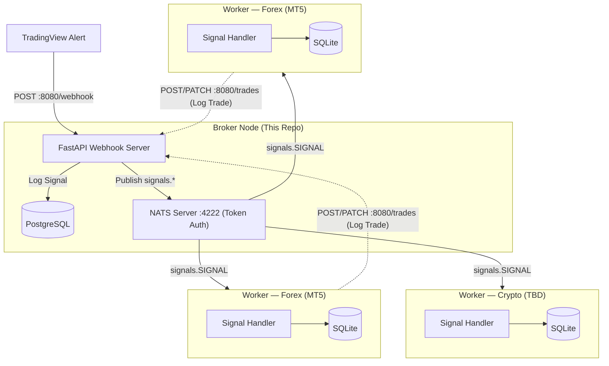

# Algo Trading Broker

A high-performance, decentralized **trading signal broker** built with FastAPI and NATS. It acts as a central hub between TradingView alerts and distributed execution nodes (VPS workers).

## Features

- **Webhook Hub**: Receives and validates TradingView JSON alerts (with optional HMAC signature verification).
- **Persistence**: Logs every signal and trade to **PostgreSQL** for auditing and analytics.
- **Distribution**: Fan-out signals via **NATS** with token-based authentication.
- **Notifications**: Optional Telegram alerts for broker lifecycle events and published signals.
- **Developer Friendly**: Includes Makefile, Bruno API collections, and Ruff for linting.

---

## System Architecture



---

## Project Structure

```text
algo-trading-broker/
├── broker/
│   ├── apis/            # Webhook and trade API routes
│   ├── db/              # SQLAlchemy models, engine, repository, migrations
│   ├── helpers/         # Signal and timeframe utilities
│   ├── schemas/         # Pydantic schemas (webhook, publisher, trade, core)
│   └── services/        # NatsPublisher, TelegramNotification
├── bruno/               # Bruno API client collections
├── examples/            # Example JSON payloads
├── scripts/             # Utility scripts (docker-entrypoint, etc.)
├── Makefile             # Automation shortcuts (uv, Docker, linters)
├── Dockerfile           # Production container definition
├── docker-compose.yml   # Infrastructure (PostgreSQL + NATS + Broker)
└── pyproject.toml       # uv dependencies & tool config
```

---

## NATS Security

The broker authenticates with the NATS server via **token auth**. Workers must supply the same token when subscribing.

Signals are published to NATS subjects:

| Subject | Purpose |
| --------------- | ----------------------------------- |
| `signals.SIGNAL` | Normal trading signals to workers |
| `signals.ADMIN` | Administrative / broadcast messages |

For end-to-end encryption, enable TLS on the NATS server and configure it separately (outside this repo).

---

## Quick Start

### 1. Prerequisites

- Python 3.13+
- [uv](https://docs.astral.sh/uv/)
- Docker & Docker Compose

### 2. Installation

```bash
git clone <repository-url>
cd algo-trading-broker

cp .env.example .env   # fill in values
make install-dev
```

### 3. Start Infrastructure

```bash
# Start PostgreSQL + NATS via Docker
docker compose up -d postgres nats
```

### 4. Run the Broker

```bash
# Run locally (requires postgres and nats to be reachable)
make run

# Or run the full stack via Docker with hot-reload
make dev
```

---

## Configuration (`.env`)

```env
# ── Webhook ──────────────────────────────────────────
WEBHOOK_HOST=0.0.0.0
WEBHOOK_PORT=8080

# Optional HMAC secret — set the same value in TradingView alert header
# X-Signature: <sha256-hex-of-body>
# Leave blank to disable validation.
WEBHOOK_SECRET=

# Callback API key for worker → broker trade reporting
BROKER_API_KEY=api_key

# ── NATS ─────────────────────────────────────────────
NATS_HOST=localhost        # overridden to "nats" inside Docker
NATS_PORT=4222
NATS_MONITOR_PORT=8222    # HTTP monitoring dashboard
NATS_TOKEN=changeme       # shared secret; leave blank = no auth

# ── PostgreSQL ────────────────────────────────────────
POSTGRES_HOST=localhost
POSTGRES_PORT=5432
POSTGRES_DB=algo_trading_broker
POSTGRES_USER=algo_trading
POSTGRES_PASSWORD=algotrading_broker_db_password

# ── Logging ──────────────────────────────────────────
LOG_LEVEL=INFO

# ── Telegram (optional) ──────────────────────────────
TELEGRAM_ENABLED=false
TELEGRAM_BOT_TOKEN=
TELEGRAM_CHAT_ID=           # management chat: broker lifecycle events
TELEGRAM_CHAT_CHANNEL_ID=   # signals channel: published trade alerts
```

---

## Development

| Command | Description |
| ----------------------- | ----------------------------------------------- |
| `make install` | Install production dependencies |
| `make install-dev` | Install all dependencies including dev tools |
| `make run` | Run the broker locally |
| `make dev` | Start Docker stack with hot-reload (`compose watch`) |
| `make start` | Start Docker stack detached |
| `make stop` | Stop Docker stack |
| `make logs` | Tail broker container logs (last 500 lines) |
| `make logging` | Follow broker container logs live |
| `make format` | Format code with Ruff |
| `make lint` | Run Ruff check |
| `make fix` | Auto-fix linting issues |
| `make simulate-nats` | Run NATS signal simulator (E2E test) |

---

## Webhook API

### POST `/webhook`

Receives signals from TradingView. Validates the optional HMAC `X-Signature` header if `WEBHOOK_SECRET` is set.

**Example Payload:**

```json
{
  "token": "your_secure_token",
  "strategy": "wt_cross_v1",
  "symbol": "XAUUSD",
  "timeframe": "M5",
  "timestamp": "2024-03-20T10:00:00Z",
  "position": {
    "action": "LONG",
    "price": 1900.5,
    "quantity": 0.1,
    "sl": 1890.0,
    "tp1": 1920.0,
    "tp2": 1950.0,
    "is_running": true
  },
  "indicators": {
    "wt1": 12.5,
    "wt2": 10.2,
    "ema200": 1880.0
  },
  "inputs": {
    "risk_percent": 1.0,
    "use_session": true
  }
}
```

**Supported Actions:** `LONG`, `SHORT`, `TP1`, `TP2`, `R_SL`, `SL`, `FLAT`.

---

## PostgreSQL Schema

### `signals` table

| Column | Type | Description |
| ------------------ | ---------------- | --------------------------------------- |
| `id` | UUID (PK) | Unique record identifier |
| `strategy` | String(50) | Strategy name that generated the signal |
| `symbol` | String(50) | Trading symbol (e.g., XAUUSD) |
| `timeframe` | String(20) | Chart timeframe (e.g., M15) |
| `timestamp` | DateTime | Signal generation time from TradingView |
| `action` | Enum | LONG, SHORT, TP1, TP2, R_SL, SL, FLAT |
| `price` | Float | Entry/trigger price |
| `quantity` | Float | Lot size / volume |
| `sl`, `tp1`, `tp2` | Float | Exit prices |
| `is_running` | Boolean | Strategy active state |
| `risk_percent` | Float | Risk percentage for position sizing |
| `indicators` | JSONB (Nullable) | Full technical indicator snapshot |
| `inputs` | JSONB (Nullable) | Strategy input parameters |
| `raw` | JSONB (Nullable) | Raw webhook payload |
| `createdAt` | DateTime | Broker log insertion time |

### `trades` table

| Column | Type | Description |
| ----------------------- | ------------ | ------------------------------------------ |
| `id` | UUID (PK) | Unique record identifier |
| `account_id` | String(50) | Worker's broker account ID |
| `account_leverage` | Integer | Account leverage at time of trade |
| `account_balance_init` | Float | Account balance before trade |
| `account_balance` | Float | Account balance after trade |
| `ticket` | Float | Broker-assigned order ticket number |
| `magic` | String(255) | EA magic number for order identification |
| `comment` | String(255) | Trade comment |
| `strategy` | String(50) | Strategy that originated the signal |
| `symbol` | String(50) | Trading symbol |
| `action` | Enum | LONG, SHORT, TP1, TP2, R_SL, SL, FLAT |
| `price` | Float | Execution price |
| `quantity` | Float | Lot size |
| `sl`, `tp1`, `tp2` | Float | Exit prices |
| `is_running` | Boolean | Strategy active state |
| `risk_percent` | Float | Risk percentage used |
| `status` | Enum | Trade status (e.g., OPEN, CLOSED, REJECTED) |
| `reject_reason` | String(255) | Reason if trade was rejected |
| `createdAt` | DateTime | Record insertion time |

---

## Testing

Open the `/bruno` directory with the [Bruno API Client](https://www.usebruno.com/) to find pre-configured requests for testing the webhook, health, and trade endpoints.

For end-to-end NATS signal flow testing:

```bash
make simulate-nats
```
