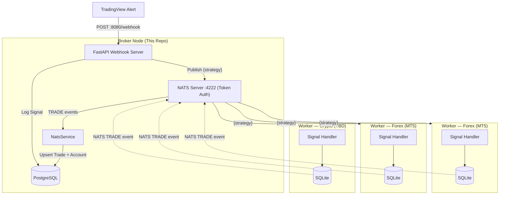

# Algo Trading Broker

A high-performance, decentralized **trading signal broker** built with FastAPI and NATS. It acts as a central hub between TradingView alerts and distributed execution nodes (VPS workers).

## Features

- **Webhook Hub**: Receives and validates TradingView JSON alerts (with optional HMAC signature verification).
- **Persistence**: Logs every signal, trade, and account snapshot to **PostgreSQL** via Alembic-managed migrations.
- **Distribution**: Fan-out signals via **NATS** — each strategy publishes to its own dedicated subject so workers subscribe only to what they need.
- **Trade Feedback**: Workers report executed positions back to the broker via the NATS `TRADE` subject (no REST endpoint required).
- **Account Tracking**: Worker accounts are auto-upserted from every incoming trade event.
- **API Key Auth**: Management endpoints (`/accounts`, `/settings/*`) are protected by an `X-API-KEY` header validated against `BROKER_API_KEY`.
- **Signal Gating**: A `SIGNAL_BLOCKED` broker setting can pause signal forwarding without restarting the server.
- **Notifications**: Optional Telegram alerts for broker lifecycle events and published signals.
- **Developer Friendly**: Includes Makefile, Bruno API collections, Alembic CLI helpers, and Ruff for linting.

---

## System Architecture



---

## Project Structure

```text
algo-trading-broker/
├── broker/
│   ├── api/             # Webhook, accounts, and settings API routes
│   ├── security/        # Auth guards (e.g. X-API-KEY via ensure_api_key)
│   ├── db/              # SQLAlchemy models, engine, repository
│   ├── helpers/         # Signal and timeframe utilities
│   ├── nats.py          # NATS connection lifecycle (connect/drain/close)
│   ├── schemas/         # Pydantic schemas (webhook, publisher, trade, account)
│   └── services/        # NatsService (publish + trade listener), TelegramNotification
├── alembic/             # Alembic migration environment and version scripts
├── bruno/               # Bruno API client collections
├── examples/            # Example JSON payloads
├── scripts/             # Utility scripts (docker-entrypoint, etc.)
├── Makefile             # Automation shortcuts (uv, Docker, Alembic, linters)
├── Dockerfile           # Production container definition
├── docker-compose.yml   # Infrastructure (PostgreSQL + NATS + Broker)
└── pyproject.toml       # uv dependencies & tool config
```

---

## NATS Subjects

The broker uses **token-based authentication** with the NATS server. Workers must supply the same token when connecting.

| Direction | Subject | Purpose |
| --------- | ------- | ------- |
| Publish (broker → workers) | `{strategy}` | Signal routed to subscribers of that strategy (e.g. `wt_cross_v1`) |
| Publish (broker → workers) | `ADMIN` | Administrative / broadcast messages |
| Subscribe (workers → broker) | `TRADE` | Position events reported by workers after execution |

Each signal is published to the subject that matches its `strategy` field. Workers subscribe only to the strategies they handle, eliminating cross-strategy noise.

---

## Quick Start

### 1. Prerequisites

- Python 3.13+
- [uv](https://docs.astral.sh/uv/)
- Docker & Docker Compose

### 2. Installation

```bash
git clone <repository-url>
cd algo-trading-broker

cp .env.example .env   # fill in values
make install-dev
```

### 3. Start Infrastructure

```bash
# Start PostgreSQL + NATS via Docker
docker compose up -d postgres nats
```

### 4. Run Database Migrations

```bash
make db-upgrade
```

### 5. Run the Broker

```bash
# Run locally (requires postgres and nats to be reachable)
make run

# Or run the full stack via Docker with hot-reload
make dev
```

---

## Configuration (`.env`)

```env
# ── Server ───────────────────────────────────────────
BROKER_PUBLIC_URL=server_ip_or_domain

# ── Webhook ──────────────────────────────────────────
WEBHOOK_HOST=0.0.0.0
WEBHOOK_PORT=80

# Optional HMAC secret — set the same value in TradingView alert header
# X-Signature: <sha256-hex-of-body>
# Leave blank to disable validation.
WEBHOOK_SECRET=

# Callback API key for authenticating requests to the broker API
BROKER_API_KEY=api_key

# Secret URL prefix — all routes are mounted under /<BROKER_API_PREFIX>/
# e.g. set to "abc123xyz" → endpoints become /abc123xyz/v1/..., /abc123xyz/admin/..., etc.
# Leave blank to use the default paths without a prefix.
BROKER_API_PREFIX=

# ── NATS ─────────────────────────────────────────────
NATS_HOST=localhost        # overridden to "nats" inside Docker
NATS_PORT=4222
NATS_MONITOR_PORT=8222
NATS_TOKEN=changeme       # shared secret; leave blank = no auth

# ── PostgreSQL ────────────────────────────────────────
POSTGRES_HOST=localhost
POSTGRES_PORT=5432
POSTGRES_DB=algo_trading_broker
POSTGRES_USER=algo_trading
POSTGRES_PASSWORD=algotrading_broker_db_password

# ── Logging ──────────────────────────────────────────
LOG_LEVEL=INFO

# ── API Docs ─────────────────────────────────────────
# Set to false in production to hide /docs, /redoc and /openapi.json.
DOCS_ENABLED=false

# ── Telegram (optional) ──────────────────────────────
TELEGRAM_ENABLED=false
TELEGRAM_BOT_TOKEN=
TELEGRAM_CHAT_ID=           # management chat: broker lifecycle events
TELEGRAM_CHAT_CHANNEL_ID=   # signals channel: published trade alerts
```

---

## Development

| Command | Description |
| ----------------------- | ----------------------------------------------- |
| `make install` | Install production dependencies |
| `make install-dev` | Install all dependencies including dev tools |
| `make run` | Run the broker locally |
| `make dev` | Start Docker stack with hot-reload (`compose watch`) |
| `make start` | Start Docker stack detached |
| `make stop` | Stop Docker stack |
| `make logs` | Tail broker container logs (last 500 lines) |
| `make logging` | Follow broker container logs live |
| `make format` | Format code with Ruff |
| `make lint` | Run Ruff check |
| `make fix` | Auto-fix linting issues |
| `make simulate-nats` | Run NATS signal simulator (E2E test) |

### Database (Alembic)

| Command | Description |
| ----------------------------- | ------------------------------------------- |
| `make db-upgrade` | Apply all pending migrations (`upgrade head`) |
| `make db-downgrade` | Roll back one migration step |
| `make db-history` | Show full migration history |
| `make db-current` | Show current revision in the database |
| `make db-revision m='msg'` | Generate a new auto-migration file |

---

## API

### Interactive docs (Swagger / OpenAPI)

FastAPI auto-generates interactive API documentation. With the server running:

| Page | URL | Notes |
| ---- | --- | ----- |
| Swagger UI | `http://localhost:8080/docs` | Try endpoints; click **Authorize** to set `X-API-KEY`. |
| ReDoc | `http://localhost:8080/redoc` | Read-only reference. |
| OpenAPI schema | `http://localhost:8080/openapi.json` | Raw spec. |

Set `DOCS_ENABLED=false` in `.env` to disable all three in production.

### URL Prefixes

All routes are grouped under versioned or purpose-scoped prefixes:

| Prefix | Router | Description |
| ------ | ------ | ----------- |
| `/v1` | API | Public API endpoints (accounts, trades, health) |
| `/admin` | Admin | Management endpoints (settings, trading actions) |
| `/secret` | Webhook | TradingView webhook receiver |

If `BROKER_API_PREFIX` is set (e.g. `abc123xyz`), every route is mounted under that secret segment:

```text
/abc123xyz/v1/health
/abc123xyz/v1/accounts
/abc123xyz/admin/flat
/abc123xyz/secret/webhook
```

The prefix acts as a URL secret — an attacker who knows the IP or domain still cannot enumerate endpoints without it. Leave blank to use the default paths.

### Authentication

Management endpoints require an API key passed in the `X-API-KEY` header, validated against `BROKER_API_KEY`:

```bash
curl http://localhost:8080/v1/accounts -H "X-API-KEY: $BROKER_API_KEY"
```

Missing or invalid keys return `401 Unauthorized`. If `BROKER_API_KEY` is unset, protected endpoints return `500`. The `/v1/health` and `/secret/webhook` endpoints are **not** key-protected (`/secret/webhook` uses its own in-payload `token`).

| Endpoint | Auth |
| -------- | ---- |
| `GET /v1/health` | None |
| `POST /secret/webhook` | In-payload `token` (+ optional HMAC) |
| `GET /v1/accounts` | `X-API-KEY` |
| `GET /v1/{account_id}/trades` | `X-API-KEY` |
| `POST /admin/settings/block-signal` | `X-API-KEY` |
| `POST /admin/settings/silent-signal` | `X-API-KEY` |
| `POST /admin/settings/include-signal-raw` | `X-API-KEY` |
| `POST /admin/flat` | `X-API-KEY` |

---

### GET `/v1/health`

Returns `{"status": "ok"}`. No authentication required.

---

### POST `/secret/webhook`

Receives signals from TradingView. Validates the optional HMAC `X-Signature` header if `WEBHOOK_SECRET` is set. Publishes the signal to the NATS subject matching `signal.strategy` (e.g. `wt_cross_v1`).

**Example Payload:**

```json
{
  "token": "your_secure_token",
  "strategy": "wt_cross_v1",
  "symbol": "XAUUSD",
  "timeframe": "M5",
  "timestamp": "2024-03-20T10:00:00Z",
  "position": {
    "action": "LONG",
    "price": 1900.5,
    "quantity": 0.1,
    "sl": 1890.0,
    "tp1": 1920.0,
    "tp2": 1950.0,
    "is_running": true
  },
  "indicators": {
    "wt1": 12.5,
    "wt2": 10.2,
    "ema200": 1880.0
  },
  "inputs": {
    "risk_percent": 1.0,
    "use_session": true
  }
}
```

**Supported Actions:** `LONG`, `SHORT`, `TP1`, `TP2`, `R_SL`, `SL`, `FLAT`.

---

### GET `/v1/accounts`

Returns all trading accounts ordered by most recent activity. Requires the `X-API-KEY` header.

**Response:**

```json
[
  {
    "id": "uuid",
    "account_id": "12345678",
    "account_name": "Demo Account",
    "account_balance": 10000.0,
    "market_type": "FOREX",
    "last_activity_at": "2024-03-20T10:05:00Z",
    "createdAt": "2024-03-01T00:00:00Z",
    "updatedAt": "2024-03-20T10:05:00Z"
  }
]
```

Accounts are automatically created or updated each time a `TRADE` event arrives from a worker.

---

### GET `/v1/{account_id}/trades`

Returns a paginated list of trades for the given account. Requires the `X-API-KEY` header.

**Query Parameters:**

| Parameter | Default | Description |
| --------- | ------- | ----------- |
| `limit` | `20` | Number of results (1–100) |
| `offset` | `0` | Skip this many rows |
| `order` | `desc` | Sort direction: `asc` or `desc` |
| `order_by` | `updatedAt` | Sort column: `updatedAt`, `createdAt`, `status`, `symbol` |

**Response:**

```json
{
  "data": [
    {
      "id": "3fa85f64-5717-4562-b3fc-2c963f66afa6",
      "account_id": "MT5-12345678",
      "strategy": "BTC-M15",
      "symbol": "BTCUSDT",
      "action": "LONG",
      "price": 65000.0,
      "quantity": 0.01,
      "status": "OPENED",
      "createdAt": "2026-06-01T08:00:00Z",
      "updatedAt": "2026-06-02T09:30:00Z"
    }
  ],
  "page": {
    "total": 42,
    "limit": 20,
    "offset": 0,
    "order": "desc",
    "order_by": "updatedAt"
  }
}
```

---

### POST `/admin/settings/block-signal`

Toggles the `SIGNAL_BLOCKED` broker setting between `"1"` (signals blocked) and `"0"` (signals forwarded). Requires the `X-API-KEY` header. Does not require a restart. Sends a Telegram notification on change.

---

### POST `/admin/settings/silent-signal`

Toggles the `SILENT_SIGNAL` broker setting between `"1"` (Telegram notifications muted) and `"0"` (notifications active). Useful for pausing alerts without disabling Telegram entirely. Requires the `X-API-KEY` header.

---

### POST `/admin/settings/include-signal-raw`

Toggles the `NOTIFICATION_INCLUDE_SIGNAL_RAW` setting. When enabled (`"1"`), Telegram signal notifications include the full `indicators` and `inputs` blocks. Requires the `X-API-KEY` header.

---

### POST `/admin/flat`

Publishes a `FLAT` directive to all connected workers via the `ADMIN` NATS subject. Scope can be narrowed by passing optional fields in the JSON body.

**Request Body (all fields optional):**

```json
{
  "strategy": "wt_cross_v1",
  "symbol": "XAUUSD",
  "account_id": "MT5-12345678"
}
```

Omit all fields (or send an empty body `{}`) to flat every open position across all workers.

---

## PostgreSQL Schema

### `signals` table

| Column | Type | Description |
| ------------------ | ---------------- | --------------------------------------- |
| `id` | UUID (PK) | Unique record identifier |
| `strategy` | String(50) | Strategy name that generated the signal |
| `symbol` | String(50) | Trading symbol (e.g., XAUUSD) |
| `timeframe` | String(20) | Chart timeframe (e.g., M15) |
| `timestamp` | DateTime | Signal generation time from TradingView |
| `action` | Enum | LONG, SHORT, TP1, TP2, R_SL, SL, FLAT |
| `price` | Float | Entry/trigger price |
| `quantity` | Float | Lot size / volume |
| `sl`, `tp1`, `tp2` | Float | Exit prices |
| `is_running` | Boolean | Strategy active state |
| `risk_percent` | Float | Risk percentage for position sizing |
| `indicators` | JSONB (Nullable) | Full technical indicator snapshot |
| `inputs` | JSONB (Nullable) | Strategy input parameters |
| `raw` | JSONB (Nullable) | Raw webhook payload |
| `createdAt` | DateTime | Broker log insertion time |

### `trades` table

| Column | Type | Description |
| ----------------------- | ------------ | ------------------------------------------ |
| `id` | UUID (PK) | Unique record identifier |
| `account_id` | String(50) | Worker's broker account ID |
| `account_leverage` | Integer | Account leverage at time of trade |
| `account_balance_init` | Float | Account balance before trade |
| `account_balance` | Float | Account balance after trade |
| `ticket` | BigInteger | Broker-assigned order ticket number |
| `magic` | String(255) | EA magic number for order identification |
| `comment` | String(255) | Trade comment |
| `strategy` | String(50) | Strategy that originated the signal |
| `symbol` | String(50) | Trading symbol |
| `action` | Enum | LONG, SHORT, TP1, TP2, R_SL, SL, FLAT |
| `price` | Float | Execution price |
| `quantity` | Float | Lot size |
| `sl`, `tp1`, `tp2` | Float | Exit prices |
| `is_running` | Boolean | Strategy active state |
| `risk_percent` | Float | Risk percentage used |
| `status` | Enum | Trade status (OPEN, CLOSED, REJECTED, …) |
| `reject_reason` | String(255) | Reason if trade was rejected |
| `createdAt` | DateTime | Record insertion time |
| `updatedAt` | DateTime | Last update time |

### `accounts` table

| Column | Type | Description |
| ------------------- | ------------ | ------------------------------------------ |
| `id` | UUID (PK) | Unique record identifier |
| `account_id` | String(50) | Worker's broker account ID (unique) |
| `account_name` | String(255) | Display name of the account |
| `account_balance` | Float | Most recent account balance |
| `market_type` | Enum | `FOREX` or `CRYPTO` |
| `last_activity_at` | DateTime | Timestamp of the last TRADE event received |
| `createdAt` | DateTime | Record insertion time |
| `updatedAt` | DateTime | Last update time |

### `broker_settings` table

| Column | Type | Description |
| ------- | ------------ | --------------------------------------- |
| `id` | UUID (PK) | Unique record identifier |
| `key` | String(255) | Setting key (see known keys below) |
| `value` | String(255) | Setting value (`"0"` / `"1"` for flags) |

**Known setting keys:**

| Key | Default | Description |
| --- | ------- | ----------- |
| `signal_blocked` | `"0"` | Pause signal forwarding to workers |
| `silent_signal` | `"0"` | Mute Telegram signal notifications |
| `notification_include_signal_raw` | `"0"` | Append indicators/inputs to notifications |

---

## Testing

Open the `/bruno` directory with the [Bruno API Client](https://www.usebruno.com/) to find pre-configured requests for testing the webhook, accounts, settings, and health endpoints.

For end-to-end NATS signal flow testing:

```bash
make simulate-nats
```
